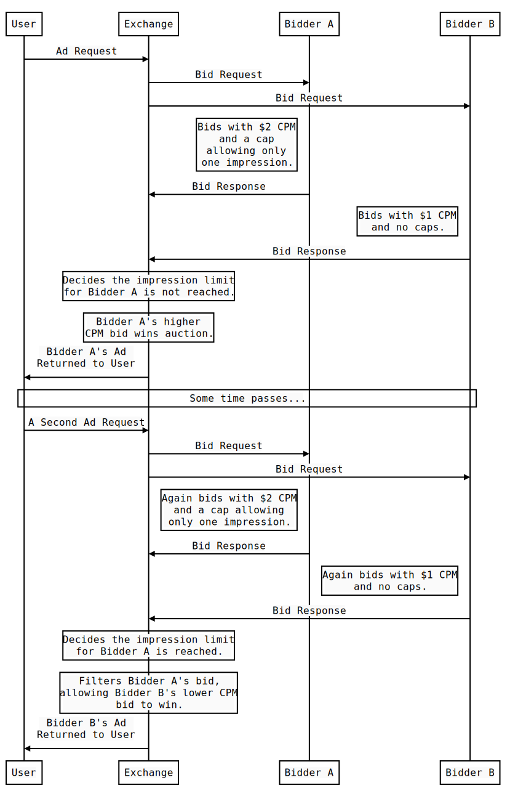

# Experiment Proposal: Exchange-Enforced Frequency Capping

*The experiment proposal does not reflect plans of any browser, including Chrome, to support similar means of in-browser ad personalization. While publicly sharing the results of these experiments can lead to productive discussions between ad tech companies as well as browser vendors and privacy advocates on how ad personalization can be supported with stronger user privacy protections, these discussions may not necessarily lead to browsers building support for the use case or the flow similar to the one proposed in this experiment.*

*The experiment may influence, but does not necessarily represent Google’s current or future real-time bidding product plans.*

## Background

Advertisers may often wish to ensure a user does not see too many impressions for a particular ad, campaign, product, et cetera. This feature is called frequency capping and it is one of the most basic, and most critical, components of the buying strategy for virtually every bidder - used everywhere from planning campaign budgets to modifying bids.

### Motivating Use Case(s)

User feedback demonstrates a general dislike of repetitive ads. Some RTB demand platforms would simply not bid on inventory without an effective way to enforce frequency caps. The main reason is that without frequency capping they cannot guarantee the reach of a campaign and cannot control ROI per user. It is wasteful for advertisers to spend their budget buying numerous impressions for the same user. Showing the same ad to the same user many times typically results in a suboptimal campaign performance. 

### Existing Work

DSPs and ad networks typically use impression counters keyed by pseudonymous identifiers derived from third party cookies or device advertising identifiers that may be present in bid requests to enforce frequency caps.

Chrome’s [TURTLEDOVE](https://github.com/WICG/turtledove) proposal (part of the [Privacy Sandbox](https://www.chromium.org/Home/chromium-privacy/privacy-sandbox)) [suggests frequency caps may be enforced](https://github.com/WICG/turtledove#on-device-auction) in an on-device auction. [PETREL](https://github.com/w3c/web-advertising/blob/master/PETREL.md) proposal explores on-device exclusion ad targeting, allowing to avoid showing a given ad to a user who is a member of an ‘exclusion group’; similar idea can be used as a building block for frequency capping.

### Goal

We would like to ensure that critical frequency capping use cases can be supported via RTB without relying on the presence of user identifiers in bid requests, thus allowing the industry to improve user privacy protections in RTB.

### Non-Goals

This experimental proposal does not yet aim to implement cross-exchange frequency capping. It also does not aim to implement frequency capping for Safari ITP or similar cases, where cross-site user identifiers are not available to advertising exchanges and bidders.

These use cases can be explored in subsequent proposals.

## Proposal

An exchange could allow bidders to specify frequency caps in the bid response. The exchange should be able to identify when an additional impression would violate the limits specified in the caps for a given user (by impression counting or some other means) and filter bids where this is the case.

### Assumptions

The experiment assumes that exchanges have the means of identifying the same user across different sites or mobile apps in respective environments – for instance, by using a pseudonymous identifier based on a third-party cookie or a mobile device advertising identifier. Addressing restrictions to the third-party cookies that different browsers have rolled out or are exploring rolling out is out of scope for this experiment.

### Design Details

Bidders will be able to specify requested frequency caps in the bid response. If an additional impression would violate the specified caps, then the bid would be filtered and would not participate in the auction.
Below is an illustration of a very basic use case involving a user, an exchange, and two bidders:



A frequency cap specification consists of an ID, time unit, time range, and a maximum number of impressions.

In the OpenRTB protocol, frequency caps can be added to the `fcap` field in the `Bid` object extension. The JSON schema could look as follows:

```json
{
  "description": "OpenRTB representation of a frequency cap.",
  "type": "object",
  "properties": {
    "fcap_id": {
      "description": "The ID of the frequency cap.",
      "type": "string"
    },
    "time_unit": {
      "description": "Unit of time used in describing capping duration.",
      "type": "string",
      "enum": ["MINUTE", "DAY", "WEEK", "MONTH", "INDEFINITE"]
    },
    "time_range": {
      "description": "The number of 'time_unit' in the capping duration.",
      "type": "integer",
      "default": 1,
      "minimum": 1
    },
    "max_imp": {
      "description": "The maximum number of impressions allowed.",
      "type": "integer",
      "minimum": 1
    }
  },
  "required": ["fcap_id", "time_unit", "max_imp"]
}
```

Notice how there is no mention of creatives, line items, campaigns, or any other such concept. This gives bidders the flexibility to use frequency caps however they see fit. Specifically, `max_impressions` indicates how many impressions a user is allowed to view which originated from bids with the same `fcap_id` and duration (as specified by `time_unit` and `time_range`), regardless of which creative the bid contains. The following examples illustrate this.

#### Example 1:

Suppose a bidder is running a campaign called `video-campaign-US` and wants to allow users to see at most 10 impressions per week from any creative which is part of that campaign. They would want to add the following frequency cap to their bid responses whenever they bid with a creative from that campaign.

```jsonc
// Bid response
{
  "seatbid": [{
    "bid": [{
      "ext": {
        "fcap": [{
          "fcap_id": "video-campaign-US",
          "time_unit": "WEEK",
          "time_range": 1,
          "max_imp": 10
        }]
      }
    }]
  }]
}
```

#### Example 2:

Suppose a bidder has a single creative with ID `123` and wants to limit the number of times any user sees this creative. They wish to only allow 10 impressions per week. Also, to make sure the user doesn’t see the impressions all at once, they additionally want to only allow 3 impressions every 2 days. They might use the following frequency caps:

```jsonc
// Bid response
{
  "seatbid": [{
    "bid": [{
      "ext": {
        "fcap": [{
          "fcap_id": "creative-123",
          "time_unit": "WEEK",
          "time_range": 1,
          "max_imp": 10
        }, {
          "fcap_id": "creative-123",
          "time_unit": "DAY",
          "time_range": 2,
          "max_imp": 3
        }]
      }
    }]
  }]
}
```

#### Example 3:

Suppose we once again have a campaign called `video-campaign-US`. A bidder wants to limit the impressions from this campaign as well as impressions from each creative within the campaign. They might achieve this with the following frequency caps:

```jsonc
// Bid response
{
  "seatbid": [{
    "bid": [{
      "ext": {
        "fcap": [{
          "fcap_id": "video-campaign-US",
          "time_unit": "WEEK",
          "time_range": 2,
          "max_imp": 25
        }, {
          "fcap_id": "creative-123",
          "time_unit": "WEEK",
          "time_range": 2,
          "max_imp": 5
        }]
      }
    }]
  }]
}
```

#### Example 4:

Bidders can also limit the number of impressions a user can see over longer time periods. They can use the `INDEFINITE` time period to limit impressions over a long period of time (≫1 month). This can be combined with other caps as well. For instance:

```jsonc
// Bid response
{
  "seatbid": [{
    "bid": [{
      "ext": {
        "fcap": [{
          "fcap_id": "example-id-abc",
          "time_unit": "WEEK",
          "time_range": 1,
          "max_imp": 10
        }, {
          "fcap_id": "example-id-abc",
          "time_unit": "INDEFINITE",
          // No need to add time_range for INDEFINITE frequency caps.
          "max_imp": 50
        }]
      }
    }]
  }]
}
```

Frequency caps are applied to each bid independently. This means that a bidder may include additional bids in their bid response if they would like an alternate bid to be considered should their frequency-capped bid be rejected.

#### Limitations & Things to Consider

Bidders should ensure IDs are unique for each unit on which they wish to apply frequency capping (e.g creative, campaign, line item).

It is up to the exchange how to handle certain edge cases, for instance, if a bidder bids with the same `fcap_id`, but keeps changing the duration. 

This experiment proposal does not cover enforcing frequency caps across different exchanges. So for instance if bidders bid with `max_imp=10` on multiple ad exchanges, a user could see more than 10 impressions total, but no more than 10 from each exchange. It is possible to address this in later experiments. Some potential solutions include:

 - Allowing bidders to inform an exchange about impressions rendered by other exchanges via a server-to-server ping or some other mechanism.

 - Frequency caps could be allocated across different exchanges with modeling. For instance, if an advertiser wants to cap total impressions at 10 and believes a user sees 70% of impressions from Exchange A and 30% of impressions from Exchange B, they could bid with `max_imp=7` and `max_imp=3` on exchanges A and B, respectively.

## Success metrics

The most important success metric is that frequency caps are enforced accurately by the exchange.

A byproduct of a successful capping implementation is that any given frequency-capped ad, campaign, etc. should have a broader reach and should be seen by more unique users.

Frequency caps chosen optimally contribute to higher click-through rates and other performance metrics. In this experiment, we can compare click-through rates between the control and the experiment groups to ensure similar performance can be achieved.

