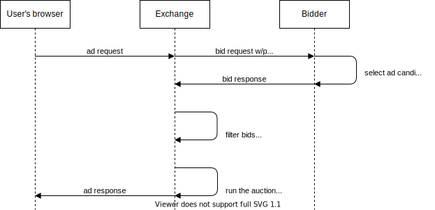

# Experiment proposal: Evaluate the impact of the TURTLEDOVE micro-targeting protections

## Background

[TURTLEDOVE](https://github.com/WICG/turtledove) is a [Chrome Privacy Sandbox](https://www.chromium.org/Home/chromium-privacy/privacy-sandbox) proposal aimed to support advertising targeted to interest groups without cross-site tracking of users or the reliance on third-party cookies. As one of its stated goals, TURTLEDOVE aims to protect users from micro-targeting. One way suggested in the proposal to achieve this is by disallowing interest groups that are too small. Alternatively, as TURTLEDOVE explainer suggests, “it could be done by disallowing ads that would be shown to too few people; this latter alternative is explored in [Outcome-based TURTLEDOVE](https://github.com/WICG/turtledove/blob/master/OUTCOME_BASED.md)”.

## Proposal

We propose to simulate the micro-targeting protections as suggested in [Outcome-based TURTLEDOVE](https://github.com/WICG/turtledove/blob/master/OUTCOME_BASED.md) and measure the impact on the publisher revenue and advertiser performance for different minimum audience size thresholds. In addition, the metrics of the outcome-based approach can be compared to the alternative approach which disallows interest groups that are too small (minimum audience size enforcement on the inputs). This information can be a valuable input to the discussions between browsers and ad tech companies and may help shape the practical TURTLEDOVE in-browser implementation.

In the simulation, an exchange enforces the micro-targeting protections as described below, playing the role of the *server-side privacy infrastructure* described in OBTD, while its bidder partners can *submit bids normally or via the flow described in [TURTLEDOVE simulation experiment](https://github.com/google/ads-privacy/tree/master/experiments/turtledove-simulation)*.

## Experiment flow
An exchange and its demand partners start off by defining the desired minimum audience size thresholds () to use in the experiment. The experiment runs on a small slice of traffic as an A/B test and involves the following steps:

1. Bidders submit bids to an exchange either normally, via the regular RTB bid responses, or by participating in the [TURTLEDOVE simulation experiment](https://github.com/google/ads-privacy/tree/master/experiments/turtledove-simulation). In either case, bidders use granular, user-level signals (subject to the existing privacy controls) – such as pseudonymous, cookie-based identifiers – for bidding decisions, as an analogue for private, browser instance-level signals described in Outcome-based TURTLEDOVE.
  
   Each bid contains a creative ID that identifies a unique advertisement and is used as the key for keeping track of the audience size  and enforcing the minimum audience size  for the ads shown in the experiment.

2. An exchange maintains a mapping table between each creative ID and the approximate audience size (number of unique users) that could be exposed to the creative if not for the minimum audience size constraints. In the experiment, an exchange may rely on the existing means of estimating the number of unique users in the audience, such as cookie-based pseudonymous identifiers. 
    
   In order to compute an audience size representative of the real-world conditions for each creative, an exchange would need to take into account all demand, including demand from the regular, non-experimental traffic.
   
   To save the storage space, the number of users could potentially be approximated with one of the probabilistic sketches, such [HyperLogLog](https://en.wikipedia.org/wiki/HyperLogLog) or its variants.

3. To ensure that a new creative can reach the minimum audience size threshold in the experiment, a new user can get accounted in the audience of a given creative under one of the two possible conditions for a given auction:

    - A creative is used in the highest-ranked bid that wins the auction (applies to non-experimental traffic as well), or

    - A creative is used in the bid that would have won the auction if not for the minimum audience size constraints (“ghost win” in [Outcome-based TURTLEDOVE](https://github.com/WICG/turtledove/blob/master/OUTCOME_BASED.md)). Given that the experiment will run on a small slice of the overall traffic, the importance of accounting for “ghost wins” is lower (new creatives still get a chance to win and grow their audience size on the production, non-experimental traffic).

4. Bids submitted with creatives that do not yet meet the desired minimum audience size threshold are filtered from the auction.

   To increase their chances of participating in the auction subject to the minimum audience size enforcement on creatives, bidders may want to return additional backup bids.

5. The exchange and its bidder partners [compare metrics](#metrics-to-evaluate) in the experiment against the control slice of traffic.

In the experiment, an exchange can use different lookback windows for aggregating the audience size for creatives, for instance, 1 day or 1 week; lookback window can be one of the experiment variables.

### Example

Let’s assume the minimum audience size threshold in the experiment to be 5 users (). 

Let’s start with the creative audience size table that looks as follows (in practice, audience size estimates may be stored by an exchange as HyperLogLog sketches, as opposed to integers):

|Creative ID     | Audience size ()|
|:---------------|-------------:|
|`running_shoe`  |           3  |
|`oled_tv`       |           5  |

We assume that the next auction is conducted for a new user that an exchange didn’t yet observe and didn’t account for in the audience size estimations for any of the creatives.

An exchange receives bids submitted by demand partners, and the following bids enter the auction:

|Creative ID     | Bid value CPM|
|:---------------|-------------:|
|`running_shoe`  |        $3.0  |
|`oled_tv`       |        $2.0  |
|`new_smartphone`|        $1.0  |

Since `running_shoe` did not yet reach  (its  would become  with this auction), it is filtered from the auction. The next best candidate, `oled_tv`, wins the auction and gets shown to the user. 

Since `running_shoe` is the top-ranked candidate that was filtered from the auction due to the minimum audience size threshold (“ghost win” in Outcome-based TURTLEDOVE), an exchange increases the audience size for `running_shoe` to 4. Audience size estimates for either `oled_tv` or `new_smartphone` do not get changed, since these creatives wouldn’t win in a “ghost auction”.

After the auction, the audience size table looks as follows:

|Creative ID     | Audience size ()|
|:---------------|-------------:|
|`running_shoe`  |           4  |
|`oled_tv`       |           5  |

`running_shoe` can win in subsequent auctions if it is chosen as the top-ranked candidate for any new user, since then `running_shoe` audience size would grow to meet .

## Experiment variables
In the experiment, an exchange and its RTB partners can control these variables and select a number of possible values of interest to understand their impact on the publisher and advertiser metrics:

- The minimum audience size for a creative: for instance, the experiment can be run with 
- The lookback window used for estimating the minimum audience size: e.g., the experiment can be run with 1-day and 7-day lookback windows.

## Metrics to evaluate

In this experiment, an exchange and its bidder partners can measure and evaluate different metrics:

- An exchange can measure impact on the publisher revenue and the number of filled impressions.
- A DSP can measure impact on the advertiser audience reach, budget delivery and campaign performance metrics (such as CPC, CPA).
