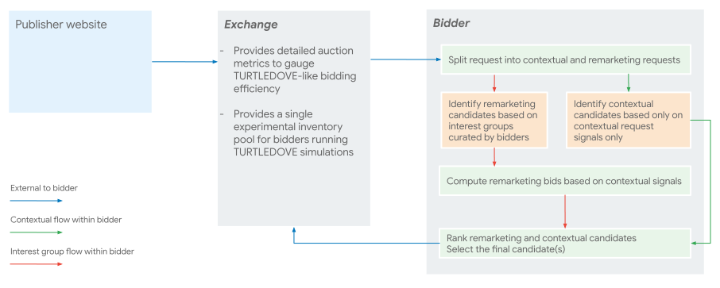

# Experiment proposal: TURTLEDOVE simulation

*The experiment proposal does not reflect plans of any browser, including Chrome, to support similar means of in-browser ad personalization. While publicly sharing the results of these experiments can lead to productive discussions between ad tech companies as well as browser vendors and privacy advocates on how ad personalization can be supported with stronger user privacy protections, these discussions may not necessarily lead to browsers building support for the use case or the flow similar to the one proposed in this experiment.*

*The experiment may influence, but does not necessarily represent Google’s current or future real-time bidding product plans.*

## Goals and addressable use cases
We propose experiments to simulate ad personalization in the absence of third party cookies in the spirit of Chrome’s [TURTLEDOVE](https://github.com/WICG/turtledove) proposal. The central idea behind [TURTLEDOVE](https://github.com/WICG/turtledove) is to protect users from cross-site tracking by separating advertiser interest group data from publisher contextual data (e.g. URLs), in ad requests. This is accomplished by splitting each ad request into two separate requests:

* A **contextual** request with publisher first-party web page information, but without cross-site identifiers or interest groups present.
* An **interest group** request with only interest groups (potentially subject to minimum interest group size), but without any contextual fields. 

These experiments will aim to achieve a few goals:

1. Understand the viability of RTB bidders using TURTLEDOVE-like approach to ad personalization.
2. Designing and iterating on the RTB interface changes and impact on various aspects of RTB integration (such as publisher controls, advertiser and publisher brand safety, creative quality checks and policies)
3. Experimenting with variables that aren't yet specified by the TURTLEDOVE proposal, or additional unknowns / features desirable by the ad technology providers.

## Success metrics

An exchange can track the following coarse topline metrics in the experiment:

- Revenue (or win) metrics
  - Total bidder spend
  - Bidder win rate and the number of auctions won / impressions rendered
- Bidding metrics
  - Number of DSP bids
  - Total DSP bid value, i.e., sum of all bids in the auction
- Performance metrics
  - Click rates

Bidders can compare important performance metrics between experiment and control groups, such as conversion rates, cost per acquisition (CPA), click-through rates and others, as well as campaign reach.

## Overall Experiment Flow
- Each ad request would be split into two separate requests:

  - A **contextual** request with user identifiers<sup>[[1]](#pseudonymous-identifiers)</sup> redacted, but including contextual data, such as site, publisher, app OpenRTB objects. 
  - An **interest group** request containing only interest groups or audience segment memberships (potentially anonymized), but without any contextual signals. 

- A bidder treats the two requests as independent so as to simulate Chrome’s proposal wherein it will be hard to correlate the two requests.

- A bidder responds with bids to the contextual and interest group requests.

- For interest group candidates TURTLEDOVE allows for the bid computation to be performed on a device using contextual signals from an exchange as well as bidder-specific derived signals that can be sent back via the contextual response. This step can be simulated by a bidder; alternatively, a bidder can submit a bidding function that can be executed in an exchange-provided server-side sandbox environment.

- An exchange collects final bids from both requests and runs an auction among those. Experiment results are evaluated to gauge efficacy of bidding logic built for the TURTLEDOVE environment.

**Note:** experiments can be diverted by an exchange on a per-user basis to ensure that participating bidders see all requests for a given user with consistent treatment – either in their traditional form without the split, or with TURTLEDOVE experiment treatment applied. 

<a name="pseudonymous-identifiers"><sup>[1]</sup></a> <small>May can include pseudonymous identifiers such as ones represented by `User.id`, `User.buyeruid`, `Device.ifa`, `Device.dpidmd5` OpenRTB fields and others with similar semantics</small>

## TURTLEDOVE experiment variants

### Bidder splits ad requests

It is likely that bidding logic may need to change substantially in order to handle separate contextual and interest group requests, each of which would not have important pieces of information available in the experiment. Initially, a bidder may want to iterate quickly in order to refine these new bidding strategies. We propose an experiment variant wherein the split of the ad request into separate contextual and interest group requests is carried out by the bidders themselves (see the diagram below).



Once bidders are able to handle two independent requests (contextual and interest group-based) internally, a joint experiment can be run with the participation of an exchange. The main purpose of this experiment would be to evaluate the efficacy of the new bidding flow in the exchange auction. The exchange can help with:

* validating how bidding performs as compared to the status quo, and
* comparing performance with respect to TURTLEDOVE bidding from other bidders by  grouping multiple bidders in the same experiment. By ensuring that all participating bidders running TURTLEDOVE bidding compete on the same traffic slice, we may be able to achieve  a more realistic simulation.

### Exchange splits requests

Once TURTLEDOVE bidding flow has been validated via the above experiment, a bidder may want to experiment with a setup that might be closer to what may be supported by browsers. 

We propose an experiment where an advertising exchange splits each request instead of a bidder, more closely simulating what TURTLEDOVE could potentially look like in practice. 
#### Sandboxed bidding function execution

An exchange can send separate contextual and interest group requests to each participating bidder who may respond with a separate set of candidates for each request. The TURTLEDOVE proposal allows for computing bids for interest group-based candidates using contextual signals available on the device. To experiment with this feature, we can allow a bidder to run the targeting/bidding logic based on interest groups present in a bid request on its servers and respond with a custom bidding function that takes into account contextual information to be run in a server-side sandbox provided by the exchange (see details belows). The bid value computed by the custom bidding function for each interest group candidate would be submitted into the regular exchange auction, after passing all existing creative policy, publisher settings and other checks.

Sequence diagram for the potential flow may look as follows:


### Experiment variables
While the TURTLEDOVE proposal impacts many facets of ad serving, a natural place to start is to evaluate its impact on bidding/targeting. Key areas to experiment with include strategies for the curation of interest groups, signals that could be incorporated into contextual and interest group bid requests and finally bidding algorithms to be run server-side as well as in the sandbox.

* **Interest group curation:** In the TURTLEDOVE model, interest group curation would need to be done either by a bidder directly in the browser or server-side based on first-party data. Bidders need to be mindful of the constraints of TURTLEDOVE and the potential [obsoletion of third-party cookies](https://blog.chromium.org/2020/01/building-more-private-web-path-towards.html) as they create interest groups, and rely on mechanisms that may be available as part of TURTLEDOVE flow. Potential avenues for experimentation could include:
  * Approaches to interest group curation compatible with an environment where cross-site tracking is not possible (e.g., relying on first-party data only)
  * Anonymization – specifically, how different potential levels of K-anonymity or the minimum interest group size may impact targeting and campaign performance

* **Bidding logic adaptation for split contextual and interest group requests.** Potential ideas for experimentation include:

  * **Server-side bidding algorithms:** server side bidder design would need to be adapted for separate interest group and contextual requests, both of which could have pieces of information important to current bidding algorithms unavailable.  Server-side bidding algorithms may need to change to produce two intermediate results based on a contextual and an interest group request to be used in an on-device bid computation.

  * **Contextual request signals:** We can experiment with the utility and effectiveness of different sets of contextual signals that could be provided in the contextual bid request, as well as made subsequently available to the bidding function. Potential variants could include:

      * Contextual signals present in the traditional bid request
      * Contextual signals derived by a bidder, returned in the contextual bid response
      * Introduction of [FLoC](https://github.com/jkarlin/floc) or anonymized audience segments to represent cohorts of similar users, provided a certain K-anonymity threshold is met.

  * **Interest group request signals:** Besides user interest groups, the TURTLEDOVE proposal could potentially allow for other potential signals to be included, such as user geolocation, language, adslot size, which could potentially simplify bidder design and help improve campaign performance. An exchange and bidders can experiment with different signals that could be incorporated in the interest group request in order to gauge their utility and impact. However care must be taken to impose appropriate privacy protections (K-anonymity or differential privacy) on all signals used for ads personalization.

  * **In-browser interest group bid computation:** The TURTLEDOVE proposal also allows for computing interest group bids in the browser-provided sandbox before they enter the in-browser auction. The idea is that it might be possible to fine-tune/customize interest group bids using signals that may  only be accessible on the device. These signals could include:
     * **Contextual:** Examples of using contextual data to affect interest group-based bid may include:
          * Advertiser brand safety enforcement (“don’t show my airline ad on pages about airplane accidents”).
          * Using contextual data for machine-learning model predictions (such as CTR) to impact the bid value.
     * **User behavior related:** for instance, how recent impression and click history could impact bid value for a given advertiser, as well as be useful for creative personalization.

Bidders can experiment with different approaches to computing bid values in a bidding function running on a device (simulated with a server-side sandbox in an experiment).

## Experiment technical specifications

This section contains tentative specifications for the interface changes between a bidder and an exchange for simulating a TURTLEDOVE-like environment, with the exchange splitting requests into contextual and interest group flows and running bidding functions in a server-side sandbox. The specifications are intended to be a starting point for a discussion and may change based on partner feedback.

### Per-candidate bidding functions

#### <a name="interest-group-bid-response"></a>Interest group bid response 

In an *interest group bid response*, a bidder would be able to return a set of possible ad candidates, each associated with a bidding function. Bidding functions may be expressed in JavaScript or, optionally, [WebAssembly](https://webassembly.org/). A bidding function would be provided in lieu of a specific bid value:

```jsonc
// Interest group bid response
{
  "seatbid": [{
    "bid": [{
      "adm": "<h1>Hello, TURTLEDOVE experiments!</h1>",
      "crid": "sparrow123",
      "adomain": "advertiser.example",
      "ext": {
        "bid_function_src": "function(…) { return …; }"
      }
    },
    //…
    ]
  }]
}
```

Creative code, as well as other metadata about a bid, such as creative ID and advertiser domain, could be provided normally as part of the interest group bid response. Thus, a **bidding function** might only need to return a **bid value**<sup>[[2]](#bid-value-format)</sup>, and a no-bid decision can be represented via a zero bid value.

A bidding function may accept bidder-specific signals derived from the contextual data, as well as the conventional OpenRTB bid request containing contextual information from an exchange.

```javascript
function getBid(exchangeRequest, biddingSignals) {
  if (!biddingSignals.brand_safety_cat.contains("covid")) {
    return 5.0; // Bid with $5.0 CPM
  }
  return 0.0; // Skip an opportunity
}
```

Note that in this variant, a bidding function can carry data (which could be encoded as JavaScript constant literals) associated with the given interest group bid that it needs to perform the final decision and compute the bid value.

<a name="bid-value-format"><sup>[2]</sup></a> <small>Optionally, a bid value could be expressed along with the desired currency, assuming exchange agreed to support a given currency a priori, for instance, by returning `{"cur": "EUR", "price": "5.5"}`.</small>

#### Contextual bid response

In addition to conventional bids based on contextual data, a **contextual bid response** may contain bidder-specific information derived from the contextual request data, including, for instance:

- CTR or viewability prediction
- Brand safety signals

Bidder-specific derived contextual information may be returned via a custom OpenRTB extension as a free-form JSON object or encoded as a single string field:

```jsonc
// Contextual bid response
{
  "seatbid": [{
    "bid": [{
      // contextual bid
    }]
  }],
  "ext": {
    "bidding_signals": {
      "ctr": 0.001234,
      "brand_safety_cat": [/*…*/]
    }
  }
}
```

```jsonc
// Contextual bid response
{
  "seatbid": [{
    "bid": [{
      // contextual bid
    }]
  }],
  "ext": {
    "bidding_signals": "SGVsbG8sIFRVUlRMRURPVkU="
  }
}
```

#### PMP deals support

Since PMP deals are typically struck between a buyer and a publisher, in TURTLEDOVE-like flow, an exchange would be expected to determine deal eligibility only at the time of contextual bid requests. There are open questions on:

1. Whether bidders would see sufficient value in their ability to transact via PMP deals for interest group bids.
2. If so, whether and how a bidding function could choose to submit a bid for a specific  deal ID.

### Fixed bidding function(s)

Constructing, returning, validating and compiling individual bidding functions for each interest group bid candidate may be costly for a bidder, an exchange and, in future, user’s browser. It may be interesting to experiment with relying on a fairly small number of bidding functions defined in advance that could operate on interest group candidate-specific data to compute a bid.

In an experiment, a bidder could share one or a small number of fixed bidding functions with an exchange ahead of time. Each such bidding function could accept input arguments representing the information about a given interest group ad candidate, as well as contextual data, and return a bid value. Each bid specified on the interest group bid response could contain:

1. A candidate-specific object to be passed to the bidding function.
2. A selector (identifier) for the bidding function to use.

Custom bidder-derived contextual data would be made available to a bidding function in the same way as described [above](#interest-group-bid-response).

```jsonc
// Interest group bid response
{
  "seatbid": [{
    "bid": [{
      "ext": {
        "candidate_signals": "Z3VhcmRpYW5zIG9mIHVzZXIgcHJpdmFjeQ==",
        "bid_function_id": "standardBid202006"
      }
    }]
  }]
}
```

```javascript
// Function communicated between a bidder and an exchange apriori
function standardBid202006(candidateSignals, exchangeRequest, biddingSignals) {
  // Take into account candidate-specific bid and 
  // a contextual placement-specific multiplier
  return decode(candidateSignals).baseBid * biddingSignals.placementMultiplier;
}
```

## Out of scope requirements for the MVP experiment

In order to reduce the complexity of the MVP experiment, a number of changes will be out of scope:

1. Creative rendering changes: traditional RTB creatives (HTML5, VAST), which may use different ad technology providers, and may perform additional personalization decisions at render time, as long as publisher controls and user consent choice are respected, where applicable, will be allowed in the experiment.
2. Impression tracking: the current means of the impression tracking, including client-side and server-to-server notifications, will be allowed.
3. Prefetching personalized ad candidates: for the MVP experiment, contextual and personalized requests will be sent to bidders at the same time. For the purposes of the experiment, we assume that bidders would keep the contextual and the interest group flows separate and not attempt to join the data from the two at the ad request processing time.
4. Client-side ranking or auction logic: traditional auction would be run by an exchange server-side.
5. Isolated client-side publisher control enforcement: an exchange will continue to run traditional publisher controls (such as brand safety, advertiser pricing rules, ad technology vendor controls) enforcement logic server-side.
