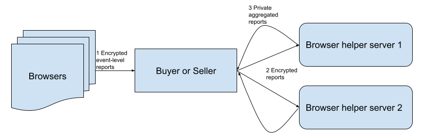

# ASTRAPIA: Ad-traffic Safety, Trusted Run, And Polling In Aggregate


*[Ribbon-tailed Astrapia image, shared under CC BY-SA 2.0, via Wikimedia Commons](https://commons.wikimedia.org/wiki/File:Ribbon-tailed_Astrapia.jpg)*

## Disclaimer

*Teams from across Google, including Ads teams, are actively engaged in industry dialog about new technologies that can ensure a healthy ecosystem and preserve core business models. Online discussions (e.g. on GitHub) of technology proposals should not be interpreted as commitments about Google ads products.*

## Background
Detecting invalid traffic (IVT) is an essential part of the ads ecosystem, and it’s an area that’s not yet well addressed in the [FLEDGE explainer](https://github.com/WICG/turtledove/blob/main/FLEDGE.md).  We present a proposal to extend FLEDGE to allow IVT detection using [Aggregate Reporting API](https://github.com/csharrison/aggregate-reporting-api) extensions.  Note that [authentication](https://github.com/WICG/conversion-measurement-api/blob/main/SERVICE.md#authenticating-inputs) is a separate topic that we do not address in this proposal.

While this proposal is designed for FLEDGE it could also work in other areas where user signals need to be limited, for example, with a privacy budget.

IVT detection models are run in two ways today:
Pre-bid: This model runs before an ad is served.  This relies on detecting whether the ad request is deemed valid or not based on either attributes of the request (e.g., request coming from data center) or entity based reputation derived from previous activity (e.g., past requests from given IP for a given website were found to all be invalid).  It’s on the critical path for ad requests.
Post-bid: This model runs after an ad is served, clicked, or converted.  This is not on the critical path to serve an ad and is run after the fact (e.g. examine arbitrary traffic slices to identify invalid traffic and label the corresponding events as invalid). Post-bid detection can be done by automated processes or also through manual analysis and labeling/enforcement.

These approaches identify different types of IVT, and both are necessary for comprehensive IVT detection.

One aspect that makes IVT detection different from other use cases is the necessity of having trained human analysts that are able to inspect ads logs to look for new sources of IVT and to respond to questions from advertisers and publishers. This is how the models above are designed in the first place and evaluated.  Note that access to event-level data is not normally needed, but it is necessary to be able to aggregate and slice by custom dimensions. The dimensions will vary depending on the nature and the sophistication of the IVT.  

## Proposal

### Human analysis
We propose using the already planned [Aggregate Reporting Helper Server](https://github.com/WICG/conversion-measurement-api/blob/main/SERVICE.md) to make sure that IVT analysts can get access to custom-aggregated data in a privacy safe way.  This means a change to Aggregate Reporting to allow interactive querying and not just batch aggregation.

The diagram below shows the current flow in which encrypted event-level data is sent to ad tech companies who use the Helper servers to decrypt it and receive only aggregated data back.



We propose extending the FLEDGE API so that buyers and sellers can both list an IVT detection provider.  For example, when defining a new interest group this is done with the **change in bold**:

<pre>
const myGroup = {
  'owner': 'www.example-dsp.com',
  'name': 'womens-running-shoes',
  'biddingLogicUrl': ...,
  'dailyUpdateUrl': ...,
  <b>'invalidTrafficProviderReportingUrl': ...,</b>
  'trustedBiddingSignalsUrl': ...,
  'trustedBiddingSignalsKeys': ['key1', 'key2'],
  'userBiddingSignals': {...},
  'ads': [shoesAd1, shoesAd2, shoesAd3],
};
navigator.joinAdInterestGroup(myGroup, 30 * kSecsPerDay);
</pre>

The *'invalidTrafficProviderReportingUrl'* would receive a copy of the full **encrypted** event-level user data in the same way as the buyer and seller.  They would not be able to decrypt this.

We then extend the Helper Servers so that rather than applying just privacy constraints to the event-level data and returning aggregated reports, they can be given an additional human-defined aggregation key to group by before applying constraints.  **This approach would allow IVT detection companies to run custom aggregation queries while maintaining user privacy.**

There are open questions about how to make sure that the query response time is fast enough for a good interactive experience that are not addressed here and which we will address in the future.

The diagram is updated to show this flow:

TODO: Attach Diagram

## Running detection models

### Pre-bid IVT models

These can continue to run on the *contextual FLEDGE* request as they do today.  The missing signals will be the interest groups that a user is in and their third-party cookie.  It’s not yet clear how important those two signals will be.

Running pre-bid models on the interest-group only request would be less useful because there is no contextual data available and so fewer signals to detect invalid traffic.  One way to work around this is to rely more heavily on the response from the contextual pre-bid model and pass that signal into the final on-device auction. These signals and the on-device auction will need to be protected from adversaries, this question is addressed by the FLEDGE proposal itself.

This diagram explains the potential pre-bid flow:

TODO: Attach Diagram

### Post-bid IVT models
As FLEDGE already supports trusted servers for the buyer and seller to supply realtime remarketing signals, we suggest adding another trusted server for IVT detection providers that can run IVT detection models over the decrypted events. This IVT trusted server can return aggregated data for IVT manual analysis, as well as aggregated IVT decisions, in order to produce clean aggregated ad data for use in buyers/sellers reporting and billing.

This trusted server does not need to be on the critical path of ad requests and so it runs later in the flow.  We’ve drawn it here as being called from the Aggregate Reporting Helper Server.  This approach effectively extends the trust boundary of the helper server, and thus the new server must abide by the same [trust model](https://github.com/google/ads-privacy/blob/master/trust-model/trust_techniques.md).

The reason to put this trusted server behind the Aggregate Reporting Helper Server is to ensure that consistent privacy budgeting is applied and noise (e.g. differential privacy, k-anonymity, etc) is added.  Custom signals can be passed to this server in the same way as for the Aggregate Reporting API.

At a high level the IVT Trusted Server API would look like this.

```
function isEventInvalid(userSignals) {
  ...
  return booleanIsIvtOrNot;
}
```

Because this won’t be a generally open API, access to the API will only be given to a list of IVT detection providers that is controlled by browsers.  Note that this is not code that would run inside the browser, it’s the API interface that the trusted server would expose for the browser to call.

TODO: Attach Diagram

### Alternatives
There are two proposals for allowing machine learning on event-level data in a privacy safe way through the use of Secure Multi-Party Computation (MPC).  Both of these would be extensible to work with IVT detection:
 * [MaCAW](https://github.com/WICG/privacy-preserving-ads/blob/main/MACAW.md)
 * [SCAUP](https://github.com/google/ads-privacy/tree/master/proposals/scaup)

## Open questions
 1. How feasible is human analysis with this proposal? Will the latency be acceptable for interactive queries? What will the impact be with [many queries](https://github.com/WICG/conversion-measurement-api/blob/main/SERVICE.md#enforcing-per-record-query-limits) made over the same events and over different dimensions? 
 1. Will there be any break-glass access for this data?  How would that work with the privacy budget plans?
 1. How will browsers administer the list of IVT detection companies who are allowed access to these new APIs?

