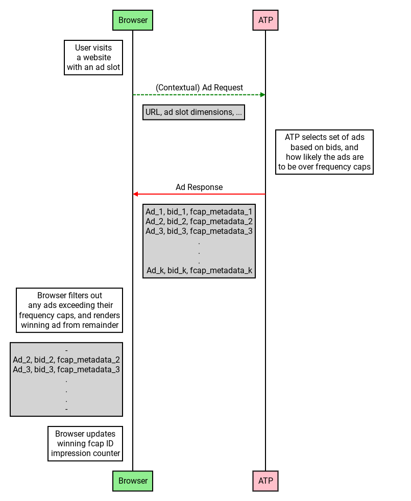

# Browser Enforced Frequency Capping

*Teams from across Google, including Ads teams, are actively engaged in industry dialog about new technologies that can ensure a healthy ecosystem and preserve core business models. Online discussions (e.g on GitHub) of technology proposals should not be interpreted as commitments about Google ads products.*

## Background

Chrome is planning to stop supporting [third-party cookies](https://blog.chromium.org/2020/01/building-more-private-web-path-towards.html) in the near future. Several APIs and standards have been proposed to support *interest group* ads ([TURTLEDOVE](https://github.com/michaelkleber/turtledove)) and audience/interest-based advertising ([FLoC](https://github.com/jkarlin/floc)) in a way that respects users' privacy ([Privacy Budget](https://github.com/bslassey/privacy-budget)) while maintaining publishers' advertising-based revenue and advertisers' utility.

An important feature for many advertisers is the ability to ensure that they are not showing the same kind of impression to the same user too frequently. This is called frequency capping. Showing impressions from the same ad, campaign, or advertiser to the same user too many times is likely to have diminishing marginal return, and is also a bad user experience. Today, frequency caps are primarily implemented using third-party cookies to measure impressions shown to each user; this will not continue to work in the future. Moreover, the Ad Tech Provider (ATP) is expected to only get aggregated impression data ([Aggregate Reporting API](https://github.com/csharrison/aggregate-reporting-api)). First party cookies may allow advertisers to cap impressions for each first party context, and modeling may enable some probabilistic frequency capping.

Here we propose a privacy-preserving mechanism for *hard* frequency capping. For performance focused advertisers, the first party approach may be sufficient; however, for brand advertising and advertisers that regulate budget through capping, this API may have significant value.

## Proposal

Frequency caps can be conceptualized as specifying a per-user *impression budget* over some amount of time. This budget may be shared between multiple ads (for example, if they belong to the same advertiser or advertising campaign). The basic idea is that the browser keeps track of impressions shown for each *impression budget*; this potentially sensitive impression data never leaves the browser. Instead, upon receiving the ad request, the ATP returns several candidate ads (and corresponding bids). The browser then filters out any ads that are ineligible to show for the user, and selects the highest bidding ad from the remainder. This works very naturally with the [TURTLEDOVE](https://github.com/michaelkleber/turtledove) proposal for interest group ads; however, this proposal is for interest group and non-interest group frequency capping, and may be implemented with or without turtledove. In spirit, this is similar to the proposed [Augury API](https://github.com/google/ads-privacy/tree/master/proposals/augury) for remarketing.

<p align="center"></p>

Below, we spell out some details of how this may work, while

 * supporting frequency capping at different granularities,
 * preserving users' privacy, and
 * requiring relatively minor changes from ATPs' existing workflows.

The browser state impacts the winning auction, which would create a potential fingerprinting surface if event level data were available. As a result, the key trade-off is that the frequency capped ads must go through the same [aggregate reporting](https://github.com/csharrison/aggregate-reporting-api) and [fenced frame](https://github.com/shivanigithub/fenced-frame/) rendering as [TURTLEDOVE](https://github.com/michaelkleber/turtledove). Whether this is worth it will depend on advertiser utility.

### Ad Response

Upon receiving the ad request, the ATP responds with a set of ads. In addition to the ad and bid, the ATP may optionally add some frequency capping metadata. This should be sent with every frequency capped ad response.

For example, this metadata would look like:

```jsonc
// ...
'fcap-metadata': [
  {'fcap-id': 0x0,
  'duration-secs': 3600
  'limit': 5},
  {'fcap-id': 0x1,
  'duration-secs': 7200
  'limit': 10}]
// ...
```

which corresponds to an ad with two relevant frequency caps. The first is limited to 5 impressions per user per hour, and the second is 10 impressions per user per 2 hours. These frequency cap IDs may be attached to distinct sets of other ads.<sup>[1](#footnote1)</sup>

### Browser logic

The browser maintains a table of (live) frequency cap IDs, along with a counter of impression times.<sup>[2](#footnote2)</sup> For each ad with frequency capping metadata, it should check whether the counter is exhausted to filter the ads.

After selecting the winning impression, it should update the frequency capping table for the winning ad. For each fcap ID for the winning ad:

1. Insert fcap ID, if it is new.
2. If the metadata doesn't match, update the metadata.
3. Insert the impression time into the fcap ID's Counter.
4. (optional, may be done asynchronously) The Counters may drop any event times older than frequency cap duration. Any fcap IDs with empty Counters may be dropped from the table.

Note that the browser needs only track frequency caps for an individual user's actual impressions. The computational and memory requirements associated with maintaining this should be quite manageable.

### Ad Tech Provider Modeling

From the ATP's perspective, it sends a bunch of ads to the browser without knowing the frequency capping status of the specific user behind the ad request. Thus, depending on the number of frequency capped ads being returned, it behooves the ATP to rank the ads in a way that takes the likelihood of being ineligible to impress into account. In particular, if the ATP uses the (expected) CPM bid to rank ads before frequency capping, one need only multiply by the probability the ad is not capped for the request to get the expected bid taking the browser enforced capping into account.

To be effective, the ATP needs to model and predict impressions per user from aggregate reporting, first party data, or other sources. This is largely required anyway to enable the *soft*, probabilistic frequency capping that would exist without this browser API. Put another way, whatever frequency capping approach ATPs are planning to do absent this API or third party cookies can continue to be useful. This API gives advertisers the option to enforce a hard cap (perhaps larger than some soft target), which cuts off the tail in the distribution of impressions per user. See [aggregate reporting](https://github.com/csharrison/aggregate-reporting-api#advanced-example-calibrating-a-frequency-capping-model) discussion on frequency capping model calibration.

### With TURTLEDOVE Interest Groups

This is very similar in spirit to TURTLEDOVE proposal. In particular, the [example API](https://github.com/WICG/turtledove#api-example-flow) implies largely similar functionality for interest group ads. For interest group ads returned on the interest group request call within TURTLEDOVE, the only substantive modification to the example is to add frequency cap IDs, to allow ATPs to cap multiple ads together.

The more significant change is that we imagine enabling the same mechanism for non-interest group ads sent on the *contextual* ad request. Note that with the frequency cap IDs, there is no reason a prefetched TURTLEDOVE ad and non-interest group ad cannot share the same impression budget. The other significant change to the flow is now there are multiple ads sent as part of the *contextual* ad response; the browser then filters and selects a winner.

### Relationship to other discussions and proposals

This is similar, with some significant changes, both to the (implicit) [TURTLEDOVE API](https://github.com/WICG/turtledove#api-example-flow) and to the API discussed in [Experiment proposal: Exchange-Enforced Frequency Capping](https://github.com/google/rtb-experimental/tree/master/experiments/frequency-capping).

## Possible Issues

### What if there frequently are no eligible ads?

If the number of ads returned is too small and all of the returned ads make use of this proposal, it is possible for there to be no eligible ads. The ATP can mitigate this by improved modeling, setting soft targets below the hard limits, and risk-averse ad responses. The final option being to, for example, always return an ad with no hard frequency caps.

### Privacy Considerations

In order to prevent tracking and cross-site unmasking, the winning ad from the in-browser auction will need to be reported in an anonymous way, for example via [aggregate reporting](https://github.com/csharrison/aggregate-reporting-api). With event level reporting of the winning ad, it would be feasible to abuse this API to potentially track users across sites.

## Links to Relevant Discussion

 * [Aggregate Reporting API - Calibrating a Frequency Capping Model](https://github.com/csharrison/aggregate-reporting-api#advanced-example-calibrating-a-frequency-capping-model)
 * [Experiment proposal: Exchange-Enforced Frequency Capping](https://github.com/google/rtb-experimental/tree/master/experiments/frequency-capping)
 * [TURTLEDOVE - frequency capping, budgets, metrics, and reporting](https://github.com/WICG/turtledove#frequency-capping-budgets-metrics-and-reporting)
 * [TURTLEDOVE - API example flow](https://github.com/WICG/turtledove#api-example-flow)
 * [TERN discussion of related functionality](https://github.com/WICG/turtledove/blob/master/TERN.md#b-the-ssp)
 
<sup><a name="footnote1">1</a></sup> This is similar to JSON schema in [Experiment proposal: Exchange-Enforced Frequency Capping](https://github.com/google/rtb-experimental/tree/master/experiments/frequency-capping). Note that that proposal assumes the exchange has a persistent user ID.

<sup><a name="footnote2">2</a></sup> We leave the exact implementation of the Counter object unspecified, but this could be a queue of event times or non-empty time buckets, for example.
