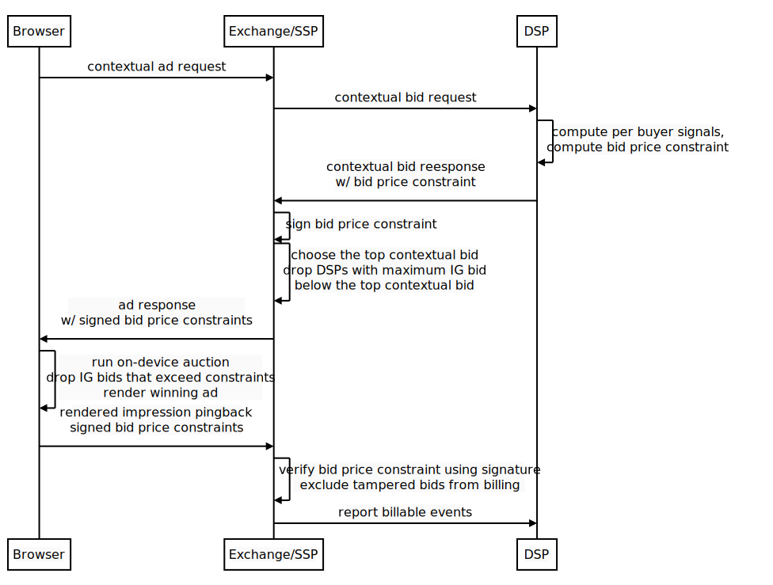

# IBIS: Interest-group Bid Integrity Support

## Summary

With [TURTLEDOVE](https://github.com/WICG/turtledove), since the bid
calculations and the auction are run locally on the device, this opens up new
potential threat vectors to compromise bid integrity that malicious actors can
take advantage of and would make it difficult to trust the outcome of the
auction coming from a user device.

Interest-group Bid Integrity Support (IBIS) proposes an approach to mitigate and
limit financial risk from these threats by providing a way for DSPs to specify a
maximum bid price determined server-side for the winning interest group ad. This
maximum bid price can then be used during the contextual ad request, on-device
auction and impression reporting in the following manner:

*   The local auction can compare the maximum bid price against the bid provided
    by the bidding function and reject the bid if it exceeds the maximum. This
    allows the auction to catch both tampered bids caused by for example
    malicious extensions or modified input signals, and legitimate but possibly
    erroneous bids from bidding function logic exhibiting unexpected behavior.
*   During the impression notification, the encoded maximum bid price as well as
    the actual winning bid price can be sent back to the SSP or the aggregate
    reporting service. The winning bid price can then be validated for use in
    billing and reporting using the DSP-specified range.
*   After determining the highest bidding contextual ad, an SSP optionally can
    use the winning contextual ad’s bid to disqualify interest group buyers from
    the auction whose maximum bid price is below the top contextual bid price.

## Proposed Flow

The updated contextual ad request flow including the proposed maximum bid price
constraints could look as follows:



## The Problem in Detail

The problem arises from the interest group bidding functions and the on-device
auction that are invoked locally on the user’s device. Execution locally
introduces the likelihood of manipulating the results of this process, or even
simulating a fake TURTLEDOVE-style auction altogether. This could be taken
advantage of to produce an undesirable outcome for the auction and for the ad
impression afterwards. Specifically this allows the possibility of reporting
potentially an arbitrary winning bid price for the ad impression, which a DSP
could be potentially financially responsible for.

### Why would on-device bids be tampered with?

Two of the more common reasons could include:

*   The winning bid could be set to an arbitrarily high value to financially
    benefit a publisher, resulting in advertisers and DSPs paying high costs for
    low-value impressions or impressions that were not shown to real users. This
    can occur in real browsers or in simulated browsers. This is the main threat
    that IBIS aims to mitigate.
*   The bidding functions or the auction logic and inputs themselves could
    potentially be manipulated to change the auction outcome. This threat would
    be most plausible in a real browser, possibly caused by malicious browser
    extensions, to for example prevent a competitor’s ad from being shown or to
    increase the probability of a preferred ad to be shown instead. These types
    of threats can be mitigated by other solutions mentioned below, but will not
    be the focus of IBIS.

### Are contextual ad requests affected?

In the TURTLEDOVE proposal, contextual ad requests bids will continue to be
determined server-side. Contextual bid price can be cryptographically signed on
the seller’s server and can be sent back as part of the tracker URL when
notifying of the ad impression, similar to today’s state. Therefore there would
be no need for a bid price maximum constraint as described in this proposal for
the contextual bids.

## The Solution in Detail

The solution proposed here allows for DSPs to specify a maximum bid price
constraint server-side for their interest group ads. This maximum bid price can
then be used during the ad request and impression reporting to validate that the
winning bid price is within the DSP-specified range.

### How is the bid price range determined?

The bid price range can be determined by the DSP during the contextual ad
request flow. At this time, the DSP can use signals available from the
contextual ad request to estimate how much the ad impression could be worth. The
DSP can provide a single global maximum bid price for all of its potential
interest group ads. The advantage of this approach is the simplicity of having
only a single range that would be easier to implement, express and maintain.

It could be useful for DSPs to have the flexibility to provide different bid
price constraints for their different creatives, perhaps to value certain
creatives higher than others depending on the available contextual signals. For
instance, running shoe or apparel creatives may be priced higher for a fitness
blog, and lower for news websites. In this case, this proposal could be extended
to introduce the concept of creative groups or tiers, such that different sets
of creatives can have different maximum bid price constraints specified in the
contextual bid response.

### Couldn’t malicious actors also tamper with the maximum bid price constraint?

One concern is since the auction is run locally on the user’s device, wouldn’t
tampering still be possible with both the winning bid price and the maximum bid
price constraint reported during the impression event? If this is the case,
wouldn’t this then render the maximum bid price constraint useless?

One approach to prevent tampering with the maximum bid price would be for the
SSP to ensure the authenticity of the maximum bid price using an HMAC with a
secret key or using an asymmetric key digital signature. The signature can then
be sent back to the server during the ad impression event to validate the
legitimacy of the winning bid price for billing purposes.

During the TURTLEDOVE incremental adoption path, while event-level impression
reporting by the SSP is still available, the secret key for the signature would
only need to be known by the SSP. This allows the SSP to validate the winning
bid price coming from the local auction against the constraint. Later on, once
the impression is reported to an
[aggregated reporting service](https://github.com/WICG/conversion-measurement-api/blob/master/SERVICE.md),
the service will then play the validation role for the winning bid price, for
example, by using a
[secret-shared non-interactive proof](https://crypto.stanford.edu/prio/paper.pdf)
to validate the integrity of the bid price.

An example signature format for the event-level reporting during the TURTLEDOVE
incremental adoption could look like:

```
bid_constraint = auction_id||interest_group_owner||max_bid_price_cpm
signature = Sign(bid_constraint, SSP_SECRET_KEY)
```

### How is the maximum bid price provided to the on-device auction?

After the DSP determines the maximum bid price for their creatives for the
current contextual bid request, they can then include the bid price constraint
information as part of the bid response sent back to the SSP, and subsequently
forwarded to the on-device auction.

The bid price constraint could look like the following:

```
{
  "seatbid": [{
    ...
  }]

  // Signals that are meant for the on-device auction. Either as input
  // for the interest group bidding functions or as input to the auction.
  "ext": {
    "interest_group_bidding": {
      // Constraint for the interest group bid price used to authenticate
      // the results of the bidding function.
      "max_bid_price_cpm": ...
    }
  }
}
```

The `max_bid_price_cpm` value and their signatures will be collected by the SSP
and sent to the browser as part of the SSP’s
<code>[seller_signals](https://github.com/WICG/turtledove/blob/main/FLEDGE.md#21-initiating-an-on-device-auction)</code>,
but will not be accessible from within the IG bidding functions. The DSP can
instead choose to include the maximum bid price constraint in their
<code>per_buyer_signals</code> to use as a limit within their bidding function
logic.

### Will bid price constraints fully ensure on-device bid integrity?

Unfortunately not. The proposed maximum bid price constraint approach will not
be able to completely prevent bid manipulation. As mentioned earlier, the main
focus of IBIS is to limit impact by setting an upper bound to the financial risk
from forged or tampered ad impression events from a simulated browser or a
compromised browser.

There are other potential solutions that can be implemented in conjunction with
the maximum bid price constraint that would help address other related threat
vectors. These solutions could include:

*   Executing the bidding functions and the on-device auction in an isolated
    sandbox environment would prevent code from outside the sandbox (such as
    code from the publisher page, other participants in on-device auction,
    malicious browser extensions) to interfere with the logic or the results of
    the bidding function and the on-device auction. Isolated environments will
    also prevent faulty code from one bidding function to affect another.
*   Browsers could compute a hash of the bidding function code that can be made
    available at impression reporting time to be used by the ad tech companies
    to verify that the one of expected bidding functions computed the bid value.
*   Existing fraud and invalid traffic detection techniques could help detect
    invalid impressions such as ones generated by simulated or compromised
    browsers.
