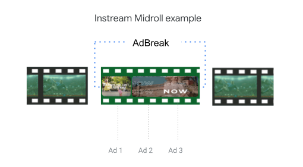
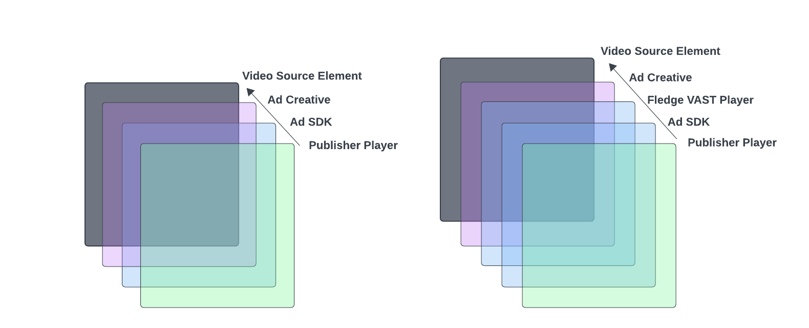

#  Protected Audience API for Instream Video


## 1. Objective

Demonstrate how instream audio/video advertising can be accomplished using the current Protected Audience API. This differs from previously published [proposals](https://github.com/privacysandbox/privacy-sandbox-demos/pull/242) because it leverages a Seller provided video player implementation loaded inside of the Protected Audience rendering iframe.


## 2. Background

The [Protected Audience API](https://github.com/WICG/turtledove/blob/main/FLEDGE.md) is based on the premise that an ad and the site where it's served can be completely isolated from each other to protect users from cross-site tracking. This is a different paradigm from instream advertising, where an ads lifecycle is intertwined with that of the video content on a website. This takes the form of a shared video playback experience, where the same video slot alternates between content and ad.




Another fundamental difference is that with instream video, it is common for the seller or the publisher to implement the ad rendering instead of the buyer. Video publishers provide a consistent and high quality user experience by using the same set of UI elements to control both the publisher's content and the ad content. This level of control allows a uniform experience even when playing ads from different demand sources.

Whereas a display ad can be communicated through HTML, a video ad is typically served through the [VAST](https://www.iab.com/guidelines/vast/) specification. An initial [proposal](https://github.com/privacysandbox/privacy-sandbox-demos/pull/242) has mitigated these problems by requiring the buyer's HTML ad to behave as a shell which simply `postMessage()` the buyer's VAST to the embedding page. This works well for allowing the seller to synchronize playback state, but requires additional complexity if buyers or sellers wish to make use of the [Fenced Frame Reporting API](https://github.com/WICG/turtledove/blob/main/Fenced_Frames_Ads_Reporting.md).

**Out-Frame Video Rendering**


In this document we will examine the alternative of rendering the VAST video ad inside of the Protected Audience iframe. Despite the need for hooks to synchronize with the embedder, aspects like VAST tracking reporting are actually easier. We believe that rendering inside the iframe is worth the effort because it aligns our short-term investments with a solution that could feasibly work in a future [Fenced Frame](https://github.com/WICG/fenced-frame) implementation (post 2026).

**In-Frame Rendering**


## 3. Design Overview

At the center of our design is a Seller-provided HTML and JavaScript implementation of a VAST video player, tailored for rendering inside of a Protected Audience API iframe. We will call this the **Protected Audience VAST Player (PAVP).**

It will behave as a normal VAST player, except for these unique properties:


*   **[Section 3.1](#31-ads-represented-as-vast):** It will fetch the buyer's VAST ad tag URI through a query parameter, for example `&vastUri=`.
*   **[Section 3.2](#32-media-player-synchronization):** It will include wiring to allow state synchronization between the publisher content player and the PAVP.
*   **[Section 3.3](#33-dynamic-vast-tracking-events):** It will implement a VAST extension which will enable reporting events to be sent using [Fenced Frame Reporting APIs](https://github.com/WICG/turtledove/blob/main/Fenced_Frames_Ads_Reporting.md).
*   **[Section 3.4](#34-seller-tracking-events):** It will inject a VAST wrapper for the seller to provide tracking events.
*   **[Section 3.5](#35-client-tracking-event-macros):** It will perform macro expansion on tracking events using contextual information provided by the publishers page.


### 3.1. Ads represented as VAST

DSPs use the [VAST standard](https://www.iab.com/guidelines/vast/) to represent their video ads because it enables ad servers to interact with each other in a standardized way. However the Protected Audience API requires Buyers to define their ads in terms of HTML for rendering.

We propose that DSP ad servers continue to return VAST and Sellers continue to handle playback of VAST creatives. To achieve this, Sellers will host an implementation of the Protected Audience VAST Player, which Buyers must use.


#### 3.1.1. Construction of renderUrl

When Buyers define a video ad as part of an interest group, its renderUrl would be constructed as the concatenation of the Sellers PAVP endpoint and their own VAST ad tag URI endpoint.

**Joining an Interest Group Example**
```
const sellerPlayer = 'https://seller-rendering.com/protected_audience_vast_player';
const adTagUri = 'https://buyer.com/vast.xml';
const encodedAdTag = encodeURI(adTagUri);
navigator.joinAdInterestGroup({
  // ...
  'ads': [{
      renderUrl: `${sellerPlayer}?vastUri=${encodedAdTag}`
  }]
});
```

This process is explored in more detail [here](https://github.com/google/ads-privacy/tree/master/proposals/fledge-formats-rendering). We recognize that the need to use a seller-specific render URL may be high friction for buyers, and are still investigating alternatives. See [Next Steps](?tab=t.0#heading=h.m2irkq63aczc) for more info.


### 3.2. Media Player Synchronization

Instream ads may be placed in an adbreak positioned before, during or after an audio/video stream. These are called Preroll, Midroll and Postroll respectively. Each ad break may have multiple ads within it.

To provide a unified user experience we must carefully allocate responsibility for playback controls between several different sources. For example, the Publishers Video Player is responsible for the buffering icon, so that a viewer will see the same spinning wheel when switching from content-to-ad, ad-to-ad or ad-to-content.


#### 3.2.1. Multiple User Interfaces

In a traditional instream video advertising setup, there are 3 UI layers which are overlaid on top of a video source element. Each layer is transparent except for the buttons, widgets or elements that they add. They also must be set to allow clicks to pass through them to lower layers.

We propose that the Protected Audience VAST Player will render its own set of UI controls inside of the Protected Audience API frame. The PAVP overlay will render VAST specific controls (such as Icons) allowing us to minimize cross-site information sharing by keeping VAST data inside the frame.

The diagram below shows a traditional setup (left) and our proposal for PAVP controls (right).





The typical arrangement for controls within each layer is the following:


*   Publisher Player UI
    *   Play + Pause button
    *   Progress Bar
    *   Volume / Mute
    *   Buffering icon
    *   Settings
*   Ads SDK UI
    *   Icons specified in VAST - Move to PAVP
    *   Skip specified by VAST - Move to PAVP
    *   Ad pod info - Optionally move to PAVP
    *   Ad countdown - Optionally move to PAVP
*   Ad Creative UI
    *   Interactivity via SIMID
    *   Format specific elements (for example, call to action)
*   Video source element
    *   Click-through

This arrangement will be adjusted so that VAST icons and VAST skip are pushed down into the PAVP. Ad pod info and Ad countdown may be rendered in the PAVP or remain in the Ads SDK UI.

> Note that some publishers would prefer to move all UI elements into the "Publisher Player UI" bucket. This is a balancing act between the desires of publishers to fine-tune every aspect of their player and advertisers desire to control their exact user experience.


#### 3.2.2. Communicating Player State

Rendering an ad UI across multiple overlays requires several pieces of state to be kept in synchronization. It also requires APIs for the outer layers to influence inner layers - for example to pause an ad, or update its volume.

**Example of clicking Pause on a Publisher Player**


At a high level, the controls and state can be bucketed as:


1. Timing (start/end)
2. Audio Levels (volume/mute)
3. Sizing (resize/fullscreen)
4. Playback (pause/resume)
5. Progress (time updates)

We propose these APIs and state update events must be sent across the Protected Audience iframe boundary using `window.postMessage`. This is intended to be the smallest set of messages required for a video ads SDK to support a single ad inside of the rendering iframe. We believe that minimizing information transfer from the ad to the publisher site in the short-term is in the spirit of the Protected Audience API privacy goals.

**Example of events from Embedder to Protected Audience VAST Player**

```
function embedderPlaybackControl() {
  // Start Playback
  frame.postMessage(encodeMsg({type: 'setPlaybackEnabled', value: true});

  // Pause ad
  frame.postMessage(encodeMsg({type: 'setPlaybackEnabled', value: false});

  // Resume ad
  frame.postMessage(encodeMsg({type: 'setPlaybackEnabled', value: true});

  // Update volume 
  frame.postMessage(encodeMsg({type: 'setVolume', value: 0.8);
  frame.postMessage(encodeMsg({type: 'setMute', value: false);
}
```

**Example of events from Protected Audience VAST Player to Embedder**
```
function protectedAudiencePlayerEvents() {
  // PAVP ready to receive events
  parent.postMessage(encodeMsg({type: 'ready', value: true});

  // Ad has been paused (perhaps due to user interaction)
  parent.postMessage(encodeMsg({type: 'paused'});

  // Ad has been resumed (perhaps due to user interaction)
  parent.postMessage(encodeMsg({type: 'resumed'});

  // Ad progress updates
  parent.postMessage(
      encodeMsg({type: 'progress', {duration: 30.1, playhead: 11.0});

  // Ad completed (includes skip and error)
  parent.postMessage(encodeMsg({type: 'complete'});
}
```

This approach requires both sides of the iframe to use the same encoding/decoding scheme and agree on a protocol for messages passed. This protocol would have to define the expected behavior for events which would alter the normal ads playback, such as media playback errors. Given these requirements, we propose that the PAVP is a part of a video ads SDK.


### 3.3. Dynamic VAST Tracking events

The performance of an instream video ad is measured using a set of tracking events which are pinged when certain events occur in the videos playback. Since different parties may be interested in different combinations of events, the VAST standard provides a way for ad servers to define what events to listen for, and the URL that should be pinged.

This is done through the `<TrackingEvents>, &lt;ClickTracking>` and `<CustomClicks>` nodes of VAST. We propose that these nodes will continue to trigger HTTP GET requests. These capabilities will be supplemented by a VAST extension enabling new Fenced Frame Reporting API tracking.

```
<Extension type="FencedFrameReportingApi">
   <TrackingEvents> ... </TrackingEvents>
   <ClickTracking> ... </ClickTracking>
   <CustomClicks> ... </CustomClicks>
</Extension>
```

Within this extension, tracking events can be declared with alternate reporting methods. In addition to the default method using HTTP GET on a URI, two new node types will be supported which enable specific [Fenced Frame Reporting APIs](https://github.com/WICG/turtledove/blob/main/Fenced_Frames_Ads_Reporting.md).


```
<FencedFrameRegisteredDestination>
<FencedFrameCustomDestination>
```


By reusing the structure of existing Tracking and Click events we intend to provide a future path for merging into the VAST standard. 


#### 3.3.1. FencedFrameRegisteredDestination Node


<table>
  <tr>
   <th>Player Support
   </th>
   <th>Required for Protected Audience API
   </th>
  </tr>
  <tr>
   <td>Required in Response
   </td>
   <td>No
   </td>
  </tr>
  <tr>
   <td>Parent
   </td>
   <td>TrackingEvents, ClickTracking, CustomClicks
   </td>
  </tr>
  <tr>
   <td>Bounded
   </td>
   <td>0-1
   </td>
  </tr>
  <tr>
   <td>Content
   </td>
   <td>(optional) The <code>eventData</code> to be included in a call to the Fenced Frame Reporting API with preregistered destination URL.
   </td>
  </tr>
  <tr>
   <th>Attributes
   </th>
   <th>Description
   </th>
  </tr>
  <tr>
   <td>    eventType
   </td>
   <td>The eventType for a registered ad beacon
   </td>
  </tr>
  <tr>
   <td>    destination
   </td>
   <td>The buyer or seller that should be pinged.
   </td>
  </tr>
</table>


This node type will tell the Protected Audience VAST Player when to send ad beacons using the [reportEvent with preregistered destination URL](https://github.com/WICG/turtledove/blob/main/Fenced_Frames_Ads_Reporting.md#reportevent-preregistered-destination-url). For each tracking event using this node, there must be a call to `registerAdBeacon` in [reportWin](https://github.com/WICG/turtledove/blob/main/FLEDGE.md#52-buyer-reporting-on-render-and-ad-events) or [reportResult](https://github.com/WICG/turtledove/blob/main/FLEDGE.md#51-seller-reporting-on-render) for the matching event type.

**Example Buyer Registration**
```
reportWin() {
   registerAdBeacon({
     video_skip_shown: 'https://adtech.example/impression?buyer_event_id=123',
  });
}
```
**Example VAST**
```
<Extension type="FencedFrameReportingApi">
   <TrackingEvents>
       <Tracking event="progress" offset="00:00:05">
       <FencedFrameRegisteredDestination eventType="video_skip_shown" destination="buyer">
           <![CDATA[event-data-123]]>
       </FencedFrameRegisteredDestination>
   </Tracking>
  </TrackingEvents>
</Extension>
```
**Example Video Player Reporting implementation**
```
window.fence.reportEvent({
  'eventType': video_skip_shown,
  'eventData': 'event-data-123',
  'destination': ['buyer']
});
```

#### 3.3.2. FencedFrameCustomDestination Node


<table>
  <tr>
   <th>Player Support
   </td>
   <th>Required for Protected Audience API
   </td>
  </tr>
  <tr>
   <td>Required in Response
   </td>
   <td>No
   </td>
  </tr>
  <tr>
   <td>Parent
   </td>
   <td>TrackingEvents, ClickTracking, CustomClicks
   </td>
  </tr>
  <tr>
   <td>Bounded
   </td>
   <td>0-1
   </td>
  </tr>
  <tr>
   <td>Content
   </td>
   <td>The URI to be pinged for the given tracking event
   </td>
  </tr>
</table>


This node type will tell the VAST player when to emit VAST tracking events using the [reportEvent with custom destination URL](https://github.com/WICG/turtledove/blob/main/Fenced_Frames_Ads_Reporting.md#reportevent-custom-destination-url-with-substitution-of-preregistered-macros). This API enables the buyer to register ad macros which will be expanded into their final tracking event URL. When transitioning to Fenced Frames there will be an additional limitation where these tracking events can only be sent to origins declared by the Buyer in their interest group definition.

**Example Buyer Registration**
```
reportWin() {
  registerAdMacro('PUBLISHER_ID', '123a');
}
```

**Example VAST**
```
<Extension type="FencedFrameReportingApi">
  <VideoClicks>
    <ClickTracking id=1>
          <FencedFrameCustomDestination>
              <![CDATA[http://destinationUrl/with-macros/${PUBLISHER_ID}]]>
       </FencedFrameCustomDestination>
    </ClickTracking>
  </VideoClicks>
</Extension>
```

**Example Video Player Reporting implementation**
```
window.fence.reportEvent({
  destinationUrl: 'http://destinationUrl/with-macros/${PUBLISHER_ID}'
});
```


### 3.4. Seller Tracking Events

The Seller may report on any VAST events that they deem interesting. We propose that they follow a traditional VAST pattern by declaring tracking events in a VAST wrapper ad which points to the Buyers ad tag URI. This allows the Seller ad server to iterate on their tracking needs without making changes to the VAST player.

This can be implemented without an extra network hop by having the Protected Audience VAST Player perform string templating locally.

**Example Seller Registration**
```
reportResult() {
   registerAdBeacon({
     impression: 'https://adtech.example/impression?buyer_event_id=123',
  });
}
```

**Example Templating**
```
const SELLER_VAST_TEMPLATE = `
<VAST>
  <Ad>
    <Wrapper>
      <VASTAdTagURI>${AD_TAG_URI}</VASTAdTagURI>
      <Extension type="FencedFrameReportingApi">
         <TrackingEvents>
            <Tracking event="start">
              <FencedFrameRegisteredDestination
                  eventType="video_skip_shown" destination="buyer">
                <![CDATA[event-data-123]]>
              </FencedFrameRegisteredDestination>
            </Tracking>
         </TrackingEvents>
      </Extension>
    </Wrapper>
  </Ad>
</VAST>
`;
function constructVast(buyerAdTagUri) {
   return SELLER_VAST_TEMPLATE.replace('${AD_TAG_URI}', buyerAdTagUri); 
}
```
**Example Generated VAST**
```
<VAST>
  <Ad>
    <Wrapper>
      <VASTAdTagURI> http://buyer-render-url-here </VASTAdTagURI>
      <Extension type="FencedFrameReportingApi">
         <TrackingEvents>
            <Tracking event="start">
              <FencedFrameRegisteredDestination
                  eventType="video_skip_shown" destination="buyer">
                <![CDATA[event-data-123]]>
              </FencedFrameRegisteredDestination>
            </Tracking>
         </TrackingEvents>
      </Extension>
    </Wrapper>
  </Ad>
</VAST>
```


### 3.5. Client Tracking Event Macros

Ad servers expect VAST players to provide some additional information in their tracking events for convenience and functionality. When rendering an ad in a Protected Audience frame contextual information is not available to the player.

We propose that the PAVP will perform replacement for the default HTTP GET tracking events, as well as the new `FencedFrameCustomDestination` tracking events. We will start with a minimal set of [VAST 4.x macros](https://interactiveadvertisingbureau.github.io/vast/vast4macros/vast4-macros-latest.html), which we believe will be viable even after post-Fenced Frame enforcement (2026+). These macros may be adjusted based on industry feedback.

Of these macros, some values are supplied contextually by the Publisher site, and others are derived from the PAVP itself. For example:


<table>
  <tr>
   <th><strong>VAST Macro</strong>
   </th>
   <th><strong>Data Source</strong>
   </th>
   <th><strong>Notes</strong>
   </th>
  </tr>
  <tr>
   <td>[ADCOUNT]
   </td>
   <td>Publisher Site
   </td>
   <td>Total count of ads expected for a video.
   </td>
  </tr>
  <tr>
   <td>[ADTYPE]
   </td>
   <td>VAST Player
   </td>
   <td>Video, audio or hybrid
   </td>
  </tr>
  <tr>
   <td>[BREAKMAXADS]
   </td>
   <td>Publisher Site
   </td>
   <td>The max ads for the given ad break
   </td>
  </tr>
  <tr>
   <td>[BREAKMAXDURATION]
   </td>
   <td>Publisher Site
   </td>
   <td>The max duration of the given ad break
   </td>
  </tr>
  <tr>
   <td>[BREAKPOSITION]
   </td>
   <td>Publisher Site
   </td>
   <td>Whether the current ad break is preroll, midroll or postroll
   </td>
  </tr>
  <tr>
   <td>[PODSEQUENCE]
   </td>
   <td>Publisher Site
   </td>
   <td>The location of the ad within a pod of ads
   </td>
  </tr>
  <tr>
   <td>[MEDIAPLAYHEAD]
   </td>
   <td>VAST Player
   </td>
   <td>Where in the video the current ad break is occurring
   </td>
  </tr>
  <tr>
   <td>[ADPLAYHEAD]
   </td>
   <td>Publisher Site
   </td>
   <td>The ad's playback position at the time of the tracking event.
   </td>
  </tr>
</table>


Replacement of contextual macros – those that are derived from the publisher’s page or the contextual ad request –  can be supported by passing macro information from the ads SDK to the PAVP using an additional postMessage event.


**Example Passing Macro from Publisher Site to PAVP**
```
function passMacroInformation() {
  const macroInfo = {
    'ADCOUNT': 2,
    'ADTYPE': 'video',
    // etc ...
  };
 frame.postMessage(encodeMsg({type: 'macros', value: macroInfo);
}
```

## 4. Life of an Instream ad in Protected Audience API

To better understand how all the different components work together, this section will weave a thread through a user's navigation across two different websites and how they could receive an instream ad through the Protected Audience API. It will focus on aspects that are unique to instream video, and leave out details of the auction for brevity.


### 4.1. Browser Joins an Interest Group


1. User navigates to Advertiser Site
2. The browser joins an interest group using a video-specific renderUrl
    1. See [Section 3.1.1](#311-construction-of-renderurl)


### 4.2. Protected Audience API Auction


1. User navigates to Publisher Site
2. Publisher Site uses an ads SDK to make an ad request to their SSP
    1. SSP runs a server-side contextual auction and returns a VAST response
    2. VAST response includes any necessary Protected Audience API auction configuration in a VAST extension
3. SDK receives and parses the ad response
4. SDK calls `navigator.runAdAuction` with the auction configuration
    * Component auction information may be provided by the Publisher site to the SDK, in order to enable multi-seller auctions
5. Top-scoring ad from the Protected Audience API, if any, is selected by the browser as the winner
6. Browser returns a URN for the winning ad to SDK

**_After the URN is assigned to an iframe and added to the DOM_**

7. Buyer and Seller use reportWin and reportResult, respectively, to report the auction outcome, and register any tracking events using `registerAdBeacon`
    * Buyer may additionally register macros for expansion using `registerAdMacro`


### 4.3. Rendering - Integration


1. SDK receives the URN of the winning ad and updates its internal ad schedule to include the returned ad.
2. User watches content video until the playhead approaches an ad break
3. SDK initiates preloading for the upcoming ad by constructing a hidden iframe and setting the source to the URN
4. Iframe loads the renderUrl, which resolves to a Protected Audience VAST Player (PAVP) provided by the seller
    * See [Section 3.1.1](#311-construction-of-renderurl)
5. PAVP reads the Buyers VAST ad tag URI from a `window.location` query parameter named `vastUri`
6. PAVP generates a Seller VAST, which is a wrapper tag pointing towards the Buyers ad tag URI
7. PAVP unwraps and fetches the VAST document
8. PAVP begins buffering media into an HTML5 Video element


### 4.4. Rendering - Playback


1. User watches content video until it reaches an ad break
2. SDK emits an event to the content video player, indicating that it should pause
3. SDK brings the PAVP iframe into view layered on top of the video player
    * Publisher player controls may be layered on top of the PAVP
    * In an ad-to-ad transition, the ads SDK may need to show or hide its UI, depending on whether the UI will be handled by PAVP
4. SDK uses postMessage to tell PAVP to start playback, including starting volume and muted state.
5. SDK maintains player synchronization for pause/resume and volume through postMessage events.
6. PAVP begins playback of ad
7. PAVP renders ad creative UI including icons, skip button, and SIMID controls
8. PAVP monitors video progress events and generates VAST events based on tracking events defined in the VAST
    * See [Section 3.3](#33-dynamic-vast-tracking-events)
9. PAVP postMessages a COMPLETE event after finished
10. SDK destroys Protected Audience iframe and continues normally


## 5. Next Steps

We intend to iterate on this proposal with the video and ad-tech industry to uncover feature gaps and come to alignment on a short to medium term solution for Video in Protected Audience API. We are looking for feedback on an [alternative](https://github.com/google/ads-privacy/tree/master/proposals/fledge-formats-rendering#proposal-2-renderurl-with-seller-rendering-macro) that may remove the need for Buyers to register a Seller-specific render URL for each interest group. In parallel we are also advocating for a [proposal](https://github.com/WICG/turtledove/issues/265#issuecomment-1823582905) to enable Seller-rendered ads as a first-class citizen in Protected Audience API.

In the coming weeks we will prototype an implementation of this proposal as part of the IMA SDK for Web and gather test-cases from the industry to better understand its limitations.

After an iframe based approach has been launched, we will consolidate our learnings into a requirements doc for Fenced Frames support for video.