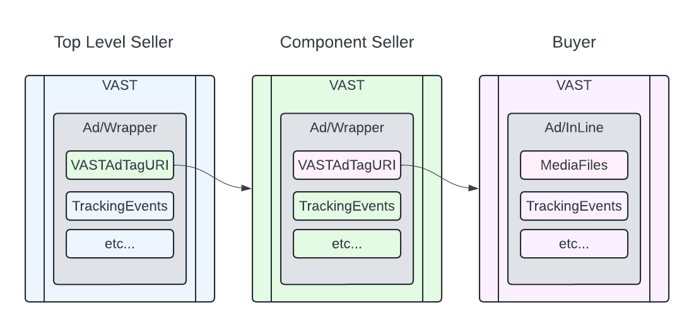
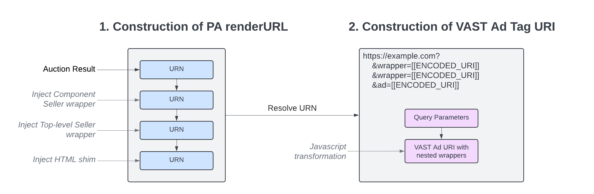
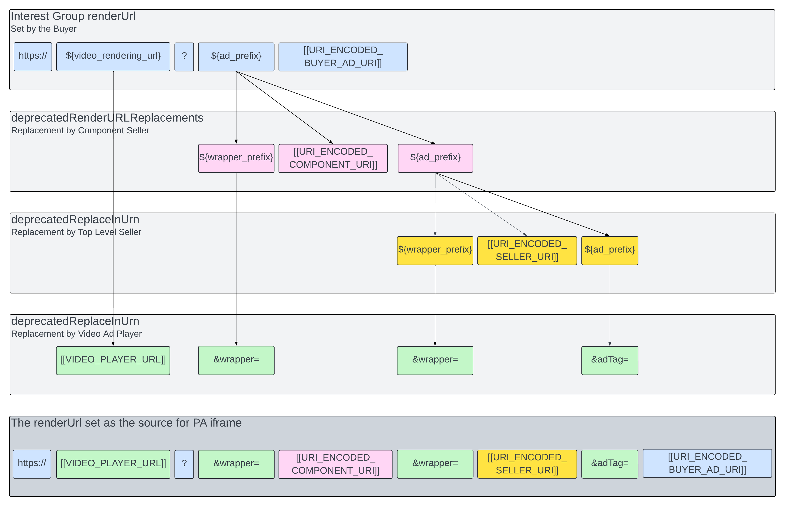
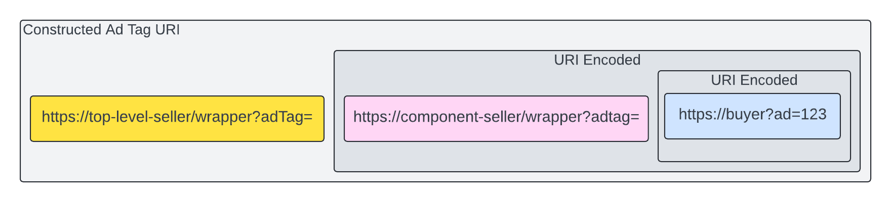

## Instream Support for Component-Seller Auction in Protected Audience API

### 1. Background

When component-seller auctions are used for video advertising, multiple parties are able to contribute to the construction of an instream VAST ad. This is done through the use of wrapper ads, enabling each entity to register their own tracking events.

In practice this consists of:

1. Top Level Seller's Wrapper VAST
2. Component Seller's Wrapper VAST
3. Buyer's inline VAST





The Protected Audience API requires an HTML page to run inside of an iframe. To map the requirements of VAST video to Protected Audience API, there is an additional requirement for the video player to provide an HTML "shim" that would execute inside of the iframe, and coordinate playback with the video player itself.

This HTML shim is the fourth input required for instream video:


4. Video Players HTML shim

We propose injecting data from all 4 sources into the interest group renderUrl using Chrome Protected Audience APIs. For this to work, buyers, component sellers, top-level sellers and video players must agree on a common strategy for constructing interest group urls and making ad requests that will resolve for all parties.

> Note: The Google Ad Manager (GAM) approach combines (1) Top Level Sellers Wrapper VAST and (4) Video Players HTML shim. This approach works best when the ads video player is managed by an ads SDK. Since this will not be true for all integrators, the rest of this proposal will assume the player and top level seller are different entities.


### 2. Overview

There are two main transformations that must occur, enabling the pass-through of information from the auction to the final VAST ad response.


1. Construction of PA renderUrl, which includes:
    + Interest group registration by the Buyer
    + Macro expansion by top level seller and component sellers
    + Macro expansions by the Video Ad Player
2. Construction of VAST Ad Tag URI, which includes:
    + An HTML shim that will coordinate with the embedding video player
    + Construction of an ad tag from the URIs provided in the renderUrl





### 3. Walkthrough of PA renderUrl


#### Join Ad Interest Group


1. Buyer creates a `renderUrl` with the following format:
```
https://${video_rendering_url}?${ad_prefix}[[URI_ENCODED_BUYER_AD_URI]]
```

For example, an initial renderUrl of the following form:

```
https://buyer.com/?video_ad=123
```

Becomes the following:
```
https://${video_rendering_url}?${ad_prefix}https%3A%2F%2Fbuyer.com%2F%3Fvideo_ad%3D123
```

#### Component Seller Opt in

2. When a user visits the publisher page (and before ad request), 3rd party component sellers would need to opt-in to the FLEDGE auction. The component seller would use the top level seller’s  on-device API to submit an `auctionConfig` to the top level seller.
    + The `auctionConfig` should contain a  `deprecatedRenderURLReplacements` that will be used to replace `${ad_prefix}` with the following template:
```
${wrapper_prefix}[[URI_ENCODED_COMPONENT_SELLER_URI]]${ad_prefix}
```

For example, component seller can pass the following config:

```js
// Example component seller's URL
//    https://component-seller-url/ad/vast.xml?ad_url=

// Example API:
adsRequest.setProtectedAudienceAuctionConfigValue({
  'componentAuctions': [{
    'seller': 'https://www.some-other-ssp-1.com',
    'deprecatedRenderURLReplacements': {
       "${ad_prefix}": "${wrapper_prefix}https%3A%2F%2Fcomponent-seller-url%2Fad%2Fvast.xml%3Fad_url%3D${ad_prefix}"
    }
  }]
});
```

#### Run Protected Audience Auction

3. The PA Auction integrator (typically the top level seller) includes the component seller’s auction config when calling `runAdAuction()`.

```js
navigator.runAdAuction({
    // ...
    'componentAuctions':  /* value from prior API call */
    // ...
});
```

4. If a video ad wins the component auction, the winning `renderUrl` may be the following:

```
https://${video_rendering_url}?${ad_prefix}https%3A%2F%2Fbuyer.com%2F%3Fvideo_ad%3D123
```

5. Before returning the winning URN, The browser executes the URL replacement for the winning component auction.
6. The returned URN references a URL that looks like the following:

```
https://${video_rendering_url}?
    ${wrapper_prefix}
        https%3A%2F%2Fcomponent-seller-url%2Fad%2Fvast.xml%3Fad_url%3D
    ${ad_prefix}https%3A%2F%2Fbuyer.com%2F%3Fvideo_ad%3D123
```


#### Top Level Seller Macro Expansion

7. The top-level seller expands macros using `deprecatedReplacedInURN()` by replacing `${ad_prefix}` with the following template.

```
${wrapper_prefix}[[URI_ENCODED_TOP_LEVEL_SELLER_URI]]${ad_prefix}
```

During replacement, `[[URI_ENCODED_TOP_LEVEL_SELLER_URI]]` is a URI encoded URI pointing to the top level seller’s VAST server. For example, the top level seller may have a URI like:

```
https://top-level-seller-url.com/wrapper.xml?adTag=123
```

After URI encoding, it becomes

```
https%3A%2F%2Ftop-level-seller-url.com%2Fwrapper.xml%3FadTag%3D123
```

After performing the macro expansion, the URN may now reference a URL that looks like:

```
https://${video_rendering_url}?
    ${wrapper_prefix}
        https%3A%2F%2Fcomponent-seller-url-1%2Fad%2Fvast.xml%3FadTag%3D
    ${wrapper_prefix}
        https%3A%2F%2Ftop-level-seller-url.com%2Fwrapper.xml%3FadTag%3D123
    ${ad_prefix}https%3A%2F%2Fbuyer.com%2F%3Fvideo_ad%3D123
```

#### Rendering URL Macro Expansion


7. The PA Auction integrator (typically the top level seller) will use `deprecatedReplacedInURN()` to replace the following macros:
    + `${video_rendering_url}`
        - The URL for the Video Ad Players HTML shim.
        - For example, `"https://doubleclick.net/td/vast.html"`
    + `${wrapper_prefix}`
        - A query parameter that HTML shim will use to read wrapper VAST URIs from its `document.location`.
        - For example` "&wrapper="`
    + `${ad_prefix}`
        - A query parameter that HTML shim will use to read the buyers VAST ad URI from its `document.location`.
        - For example` "&adTag="`

After this final round of macro expansion, the URN may now reference a URL that looks like:


```
https://doubleclick.net/td/vast.html?
    &wrapper=https%3A%2F%2Fcomponent-seller-url-1%2Fad%2Fvast.xml%3FadTag%3D
    &wrapper=https%3A%2F%2Ftop-level-seller-url.com%2Fwrapper.xml%3FadTag%3D123
    &adTag=https%3A%2F%2Fbuyer.com%2F%3Fvideo_ad%3D123
```

#### Diagram of macro expansion



### 4. Walkthrough of VAST Ad Tag URI

#### Loading of HTML Shim

1. The PA Auction integrator (typically the top level seller) may now take the URN from the previous phase and set it as the source of an iframe.
    + The loaded HTML will handle coordination with the video ad player - either by resolving the final VAST document and posting it to the parent-frame, or by bootstrapping a VAST video player to run inside the frame itself.
2. The HTML shim must read the encoded URIs provided by the top-level seller, component seller, and buyer from its query parameters and construct ad tag URI.

For example:


```js
// Within Ad video HTML Shim
function main() {
  const params = new URLSearchParams(document.location.search);
  const [wrapper1, wrapper2] = params.getAll('wrapper').map(decodeURIComponent);
  const inlineAdTag = decodeURIComponent(params.get('adTag');
  // ... continued
}
```

#### Constructing Ad Tag URI

3. The HTML shim will construct an ad tag URI by combining the wrapper ad tag URIs with the inline ad tag. The tag being resolved must be URI encoded.

For example:


```js
function main() {
  // ... continued

  function constructWrapper(wrapper, destinationAd) {
    return `${wrapper}${encodeURIComponent(destinationAd)}`;
  }

  // Note that the inlineAd tag will be double encoded.
  return constructWrapper(wrapper1, constructWrapper(wrapper2, inlineAd));
}
```


**Diagram of Ad Tag URI created by HTML shim**




#### Resolving Ad Tag URI

4. After construction of the VAST Ad Tag URI, the video ad player's HTML shim feeds the constructed ad tag URI into a VAST player for resolution.
    + The VAST player will resolve each VAST response in sequence, following Wrapper tags
    + When a wrapper ad tag URI is fetched, the endpoint must construct a valid VAST ad response containing a Wrapper with a VASTAdTagUri pointing to the provided endpoint.
    + Before making each HTTP request the VAST player will perform typical macro expansion on the ad tag uris.
5. VAST player makes initial HTTP request, fetching VAST wrapper from top level seller.
    + This may look like:

```
http://top-level-seller.com/wrapper.xml
    ?adTag=https%3A%2F%2Fcomponent_seller.com%2Fwrapper.xml%26adTag%3D=
           https%253A%252F%252Fbuyer.com%253Fvideo_ad%253D123
```

6. The top level seller returns a wrapper VAST.
7. VAST player makes an HTTP request based on wrapper, fetching VAST wrapper from component seller.
    + This may look like:

```
https://component-seller.com/wrapper.xml
    &adTag=https%3A%2F%2Fbuyer.com%3Fvideo_ad%3D123
```
8. The component seller returns a wrapper VAST pointing to the buyers ad.
9. VAST player makes an HTTP request based on wrapper, fetching VAST inline ad from Buyer.
    + This may look like:

```
https://buyer.com?video_ad=123
```
10. The buyer returns an inline VAST ad.

> Note: Parallelization of the VAST network requests would be possible if the industry agrees that sellers do not need to modify the AdTagUris being wrapped.
