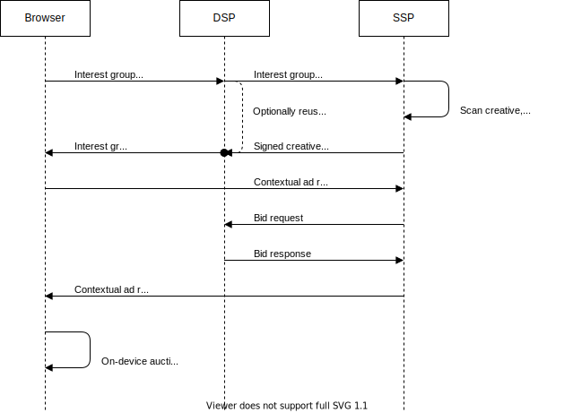
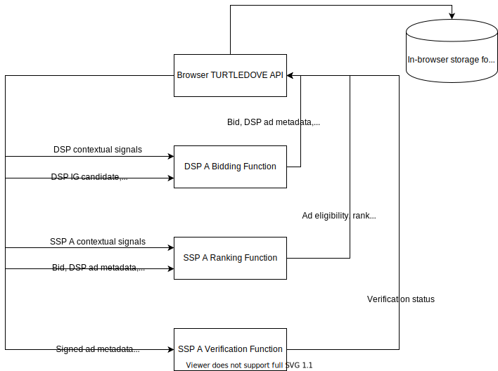

# ROBIN: RTB Out of Band Interest Group Networking
*Teams from across Google, including Ads teams, are actively engaged in industry dialog about new technologies that can ensure a healthy ecosystem and preserve core business models. Online discussions (e.g on GitHub) of technology proposals should not be interpreted as commitments about Google ads products.*

## Summary
ROBIN aims to conceptualize how ad quality checks and publisher controls can be supported in [TURTLEDOVE](https://github.com/WICG/turtledove) on-device auctions for RTB integrations between SSPs and DSPs. A central idea of this proposal is an out-of-band flow where SSPs do not participate in [interest group requests](https://github.com/WICG/turtledove/blob/master/README.md#two-uncorrelated-requests) directly, but instead the browser sends interest group requests to DSPs and ad networks. SSPs propagate creative metadata required for ad quality checks and publisher controls to the on-device auction via interest group responses returned by DSPs and ad networks. Unlike traditional contextual requests, SSPs are not involved in the routing of the interest group requests. 

By removing the dependence on SSPs to route interest group requests, this proposal has the following benefits:
* **Better user experience and reduced network traffic.** It is not uncommon for DSPs to work with multiple SSPs, sometimes in double digits. Browser does not need to send each interest group request through all the SSPs a DSP works with. Instead a single interest group request will be sent directly to the DSP. This reduces networking from user devices and the number of interest group requests a DSP receives. 
* **Resource savings for SSPs** since they do not have to route interest group requests and can rely on DSPs to cache the creative metadata on a per-creative level.
* **Lesser complexity for browsers and in-browser logic.** When the browser sends an interest group request, a user may not be at the publisher page yet and thus the SSP(s) participating in selling an impression may be unknown. If the browser was to route the interest group requests via SSPs, it might have to derive a list of all the SSPs a DSP works with when sending the interest group requests. This proposal eliminates such a need since SSPs are not directly involved in the routing of interest group requests. 

ROBIN aligns closely with [TERN](https://github.com/WICG/turtledove/blob/master/TERN.md) in its approach to information flows related to interest group ad verification by SSPs. The objective of this document is to explicitly define the data flows between SSP, DSP and the browser required for SSPs to reliably support their existing ad quality checks and publisher controls enforcement use cases. We hope this proposal can drive consensus on the standardized data flows and APIs across the industry, reducing complexity in the adoption of TURTLEDOVE for DSPs and SSPs.

Some SSPs solely rely on DSP-declared ad metadata (such as categories and advertiser domain) to enforce ad quality checks and publisher controls. Others use signals from their own ad scanning systems in addition to the DSP-provided ad metadata. This proposal focuses on the latter use case where detected classifications from an SSP’s ad scanning system might be used to enforce ad quality checks and publisher controls.

## Overview


Besides running an auction among many demand sources, SSPs also provide value to publishers by enforcing ad quality checks, brand safety blocks and other controls, such as custom pricing floors and deals. Some of these functions require contextual signals such as publisher domain and placement. In addition, an SSP may require creative metadata associated with interest group ads from their ad scanning system during the on-device auction. Since ad creatives are immutable in TURTLEDOVE, the associated metadata will not change with each request. SSPs can periodically scan DSPs’ ads and use the detected classifications to enforce publisher settings during the on-device auction. DSPs can cache the SSP’s ad metadata on a per-creative level and reuse it in their interest group response.

## Interest Group Creative Metadata
The browser sends interest group requests to the interest group owner or reader domains periodically. The owner or reader responds with the information needed for on-device bidding, such as a set of creatives, associated  metadata (e.g. categories and advertiser domain), TTL and a reference (e.g. a URL) to the bidding function. This proposal assumes that most interest group owner/reader domains will be DSPs or other ad buying systems, though it is possible that other ad technology providers can be readers too if they participate in curating or targeting interest groups. 

Each creative in the interest group response can include creative metadata provided and cryptographically signed by their SSP partners ([TURTLEDOVE Issue #72](https://github.com/WICG/turtledove/issues/72)). The signed creative metadata can be used by the SSP during the on-device auction to enforce publisher controls and ad quality checks as well as verify the metadata’s authenticity. 

Upon receiving an interest group request, a DSP can request interest group creative metadata from their SSP for the list of creatives they intend to use. If the DSP’s creative does not require pre-approval, the SSP can instantly return its signed approval status. The SSP can then scan the creative for ad quality compliance and classifications needed for enforcing publisher controls. In the subsequent interest group creative metadata request, the SSP can provide the signed metadata detected for the creative.

Considering a DSP often partners with several SSPs, it may be beneficial to standardize the protocol for sharing the interest group creatives and their associated metadata between DSPs and SSPs. Interest group creative metadata request from a DSP to an SSP can contain an object for each creative and may look as follows:

```jsonc
[{      
  'creativeId': 'ad123'
  'declaredMetadata': {'click_through_url': 'url123', 'categories'..}
  'adCborUrl': 'https://dsp.com/ads/ad-123.wbn'
  'height': 100
  'width': 200
},
{
  'creativeId': 'ad567'
  'declaredMetadata': {'click_through_url': 'url567', 'categories'..}
  'adCborUrl': 'https://dsp.com/ads/ad-567.wbn'
  'height': 150
  'width': 250
},
…
]
```

During the [incremental adoption path](https://github.com/WICG/turtledove#incremental-adoption-path), when winning interest group ads continue to be rendered with no new protections, a DSP can specify a creative using inline HTML code, for example:

```jsonc
[{
  'creativeId': 'ad123',
  'declaredMetadata': {'click_through_url': 'url123', 'categories'..},
  'adHtml': '<html> Hello World </html>',
  'height': 100,
  'width': 200
},
…
]
```

Interest group creative metadata response from an SSP to a DSP may look as follows:

```jsonc
[{
  'creativeId': 'ad123',
  // Opaque metadata provided by SSP for use in on-device auction.
  'sspMetadata': {'click_through_url': 'url567', 'categories': ..},
  'signature': 'w45rdhgg65674',
  // RFC3339 timestamp until when the metadata is valid.
  'expiryTimestamp': '2021-01-15T01:30:15.01Z'
},
…
]
```

The response contains `sspMetadata` which can be an arbitrary JSON object that an SSP uses in the on-device auction. The `signature` returned from SSP servers allows to authenticate `sspMetadata` for a given interest group ad. The SSP-detected metadata, ad content and expiry timestamp can be serialized using a canonical representation such as [CBOR](https://cbor.io/) and used to compute the signature. The signature can be generated as:

```
sign(ssp_private_key, (ad_content, ssp_detected_metadata, expiry_timestamp))
```

The `expiryTimestamp` indicates the TTL after which the signed metadata will no longer be valid from the SSP’s perspective. In case a creative was allowed to serve without review, an SSP needs a mechanism to refresh its metadata once the creative review is complete. It is also not uncommon for creative metadata to change over time despite its content remaining unchanged. This could be due to changes in the SSP’s ad scanning system or creative policies. 

In TURTLEDOVE, creatives are expected to be immutable. Based on TTL guidance provided by the SSP, both DSPs and browsers can cache the signed creative metadata. It is sufficient for DSPs to refetch the interest group creative metadata from SSP partners close to its expiration. 

The proposed out-of-band flow reduces networking from user devices, network costs for DSPs and creatives scanning resource costs for SSPs. For instance, imagine an ad network that shows ads to 1 billion users per day and has 1 million active creatives with SSP’s metadata valid for 4 hours. Caching the signed creative metadata can reduce the QPS of interest group metadata requests from a DSP to an SSP by 99% (from ~11.5k to ~70 QPS). In addition, if a DSP works with 10 SSPs on average, the network bandwidth consumed by a user device is reduced by 10x. This is because it is sufficient for browsers to send a single interest group request to the DSP rather than routing 10 requests via each of their SSP partners. The resource savings here are substantial. 

Optionally, SSPs can provide a creative scanning API that allows DSPs to submit creatives for scanning and verification prior to receiving interest group requests. This approach can reduce interest group ad filtering when working with SSPs that require creatives to be scanned before the first impression. 

## On-device Policy and Publisher Controls Enforcement


When a user visits a publisher’s site, a contextual request is sent to the SSP. The SSP routes the bid requests to their DSP partners, maintaining the status quo. In addition to the usual ad response, an SSP can include `ranking.js` [(TURTLEDOVE Issue #70)](https://github.com/WICG/turtledove/issues/70) as well as the information necessary for enforcing publisher controls and ad quality checks in an on-device auction.

During the on-device auction, `ranking.js` is responsible for enforcing ad quality checks and publisher controls alongside its other duties such as determining an ad candidate’s rank. As mentioned in [TURTLEDOVE Issue #72](https://github.com/WICG/turtledove/issues/72), the ranking function requires interest group ad metadata to perform these ad eligibility checks. 

The browser can supply an interest group ad candidate (including the signed creative metadata from various SSP partners) to the DSP’s bidding function. The bidding function can return an object that may contain a bid value, DSP-declared ad metadata, signed ad metadata from a given SSP and potentially any other information needed by the SSP running the ranking function and agreed upon by the DSP. The browser can then route the bidding function’s return value and the SSP’s contextual auction signals into `ranking.js` for determining the ad’s eligibility and rank.

If the creative metadata is missing or expired, an SSP may choose to disallow the ad from participating in the auction. Creative metadata can be compared against the publisher controls and ad policies applicable to the request to determine its eligibility to participate in the auction.

## Verifying Creative Metadata
An SSP might wish to authenticate the creative metadata used by their ranking function to determine an ad’s eligibility. To do so, we hope TURTLEDOVE API can provide support for:
* An SSP-provided JS function to verify the winning ad candidate before it is rendered.
* Access to the existing in-browser cryptographic API (such as [SubtleCrypto](https://developer.mozilla.org/en-US/docs/Web/API/SubtleCrypto/verify)) during the verification of the winning ad candidate and, optionally, while running on-device bidding and auction logic.

Signature verification may be an expensive operation, especially when repeated for each auction across many candidates. For instance, it is plausible for about 100 or more interest group ad candidates to participate in an on-device auction. Verifying the signed creative metadata for each of these ad candidates in `ranking.js` can add up to significant resource drain on a user device.

Rather than verifying every ad candidate in `ranking.js`, an SSP could instead verify just the winning ad before it is rendered. The ranking function can return an object for each ad candidate with its rank, creative metadata along with its cryptographic signature and any other information needed for verification. TURTLEDOVE API upon determining the winning ad can call an SSP-provided verification function, `verification.js`, with the information supplied by the ranking function.

`verification.js` is a JS function that executes locally within the browser and cannot send information off-device. The metadata used to determine the ad’s eligibility can be verified using the SSP’s public key hosted on a well known URL such as:

```
https://ssp.example/.well-known/public-key.txt
```

Verification of a winning ad might fail under rare circumstances involving a malicious or compromised DSP or user agent. In such cases, the browser can fallback on the highest ranked contextual ad candidate as the auction winner. TURTLEDOVE API can provide a way for SSPs to learn how frequently creative metadata verifications failed in an aggregated form, for instance, via [aggregate reporting API](https://github.com/csharrison/aggregate-reporting-api). 
