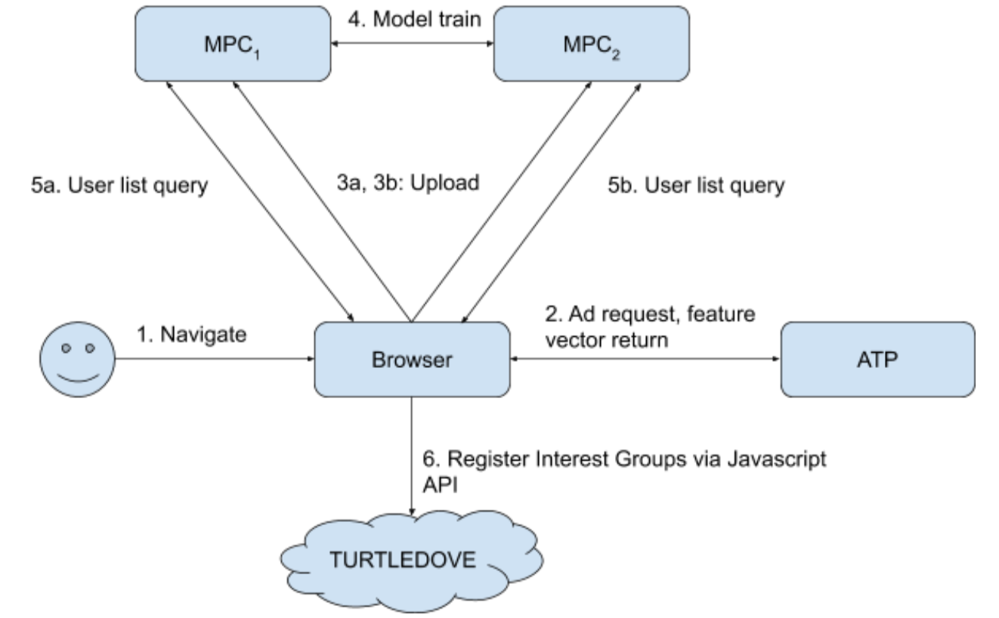
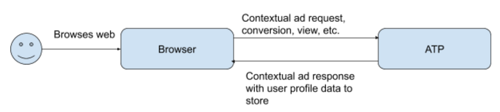
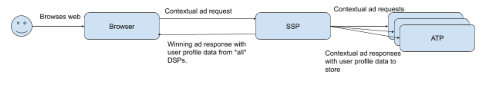
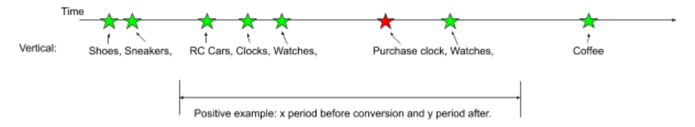

# Similar Cohort Audiences Upholding Privacy


*[Lesser scaup image from Wikipedia, shared under CC BY-SA 3.0.](https://en.wikipedia.org/wiki/Lesser_scaup)*

## Disclaimer

_Teams from across Google, including Ads teams, are actively engaged in industry dialog about new technologies that can ensure a healthy ecosystem and preserve core business models. Online discussions (e.g. on GitHub) of technology proposals should not be interpreted as commitments about Google ads products._

## Introduction

In the [W3C list of advertising use cases](https://github.com/w3c/web-advertising/blob/master/support_for_advertising_use_cases.md#lookalike-targeting), a common use case of online advertising is to find new customers.  One way to do this is to expand the audience base from customers who have engaged with a business to customers who have similar interests and behaviour and are therefore likely to engage as well.  This is also known as lookalike audience targeting.

This proposal builds directly on the TURTLEDOVE proposal and recent [related work](#related-work) by Google and others. This doc is a high level sketch and will be expanded upon in coming docs.

## Motivating Use Case

Suppose an owner of a website that sells cuckoo clocks wants to use online advertising to find new customers.

Today an Ad Tech Provider (ATP) can go about this by observing users’ behavior on publishers’ and advertisers’ sites with third-party cookies so that when customers buy cuckoo clocks, the ATP can learn about the typical cross-site behaviour of cuckoo clock customers. This model of customers can then be used to look for similar users who have not yet purchased cuckoo clocks and advertise to them.

The TURTLEDOVE proposal offers a way for ATPs to show cuckoo-clock ads to people who previously looked at cuckoo-clock web sites, without any way to track those people across sites. The goal of this proposal is a way for ATPs to show cuckoo-clock ads to people who seem similar to cuckoo-clock buyers — but without letting them track either cuckoo-clock buyers or the people they show the ads to.

We will show a way to do it as long as browsers are willing to work with two semi-trusted servers.

The servers only see opaque, encrypted, user profiles that they cannot decrypt.  We rely on special encryption techniques — homomorphic 


— that allow mathematical operations on top of encrypted data _without decrypting it._

## Design overview

We propose a method for ATPs to build user profiles on-device, from browsing behaviour, that are only accessible in cleartext by the browser and a way to build secure, private, cross-site ML models.

The browser periodically encrypts and sends user profiles to a pair of well known servers in a Secure Multi-Party Computation (MPC) setup.  So long as either one of these two servers is honest, the safety of the data, and therefore the user’s privacy, is preserved.  The two MPC servers work together to receive encrypted user profiles, together with encrypted labels, as training data. Such encrypted training data enables MPC servers to train ML models that predict whether a user should be part of a similar audience group. The training data gathering, as well as the ML training and prediction process guarantees user privacy via architecture and crypto design.

**Neither MPC server alone can decrypt the training or test data, they operate on top of the encrypted data only.**

**We believe that this MPC setup is applicable to other ads use cases beyond similar audiences and will explore those in coming docs.**

Periodically the browser queries the MPC servers to find if there are any similar-audience interest groups that the browser should join.  The MPC servers evaluate the ML models then invite the browser to join appropriate Interest Groups for ads personalization as defined in the TURTLEDOVE / SPARROW / DOVEKEY family of ads serving proposals.



*Diagram: overall flow of requests.*
1. The user navigates the web.
1. The browser makes requests to ATPs for ads, to register conversions, etc.  ATPs return feature vectors for the browser to store.
1. The browser aggregates feature vectors in the selected study period to create a user profile. The secret shares of the user profiles are sent to MPC servers.
1. MPC servers accumulate encrypted user profiles and train ML models.
1. Periodic browser querying of MPC servers for which similar audience user lists to join.
1. User lists joined via TURTLEDOVE API.

# Related work

## Facebook’s privacy-preserving lookalike audience targeting

This proposal aims to solve the same problem as Facebook’s explainer, [link](https://github.com/w3c/web-advertising/blob/master/privacy_preserving_lookalike_audience_targeting.md).  The differences are:
1. The potential ML model types differ: the initial Facebook proposal is for a centroid model and also includes a logistic regression model.  In this doc we give an API for the MPC servers which we believe we can use to support centroid, k-Nearest-Neighbour (kNN), kNN with gradient boosting, and Deep Neural Network models.
1. The potential ML models in this proposal are trained with user data collected from multiple websites instead of a single large website.
1. In this explainer the publisher does not learn the user lists that a user is added to.  [See discussion here.](https://github.com/jkarlin/floc/issues/20#issue-675232385)
1. Facebook’s proposal builds on top of the Aggregate Reporting API while here we use dedicated MPC servers.  (The Aggregate Reporting API itself uses MPC servers.)

## Magnite’s FLoC+Server

This proposal is related to FLoC+Server, [link](https://github.com/MagniteEngineering/Gatekeeper), but it has the following differences:
1. We don’t rely on a single trusted server and instead on two semi-trusted MPC servers. The API of these servers, the crypto of which we’ll go into in the detailed doc about them, guarantees that so long as one of these two servers is trustworthy then user data remains private and cannot even be read by the people running the servers.
1. The Interest Groups that we generate are more private because they are not joinable with first-party state by the publisher.  This is different to Gatekeeper where FLoC-style cohorts are used.
1. This proposal is limited to the creation of similar audiences while Gatekeeper could create other types of cohorts as well.

## Chrome’s FLoC

This proposal is substantially different to FLoC, [link](https://github.com/jkarlin/floc), in several key ways:
1. The user profile that is generated in FLoC is created and owned by the browser while in this proposal it is created by the ATP even though it is stored in the browser.
1. FLoC is designed to assign a single cluster to a user, maximizing similarity across all possible interests. This proposal allows the user to be a member of many clusters each representing ATP-defined interests: cuckoo clock buyers in our example.
1. FLoC IDs are visible to publisher pages. In comparison, because this proposal builds on TURTLEDOVE, the Interest Groups are not joinable with first-party state or sent on the same request as contextual data.

## Federated learning

This is a technique, [link](https://ai.googleblog.com/2017/04/federated-learning-collaborative.html), for distributed training of ML models without needing to share training data beyond the device that generates it.  The main difference to this proposal is the use of MPC servers for training rather than partial training on-device.  Federated learning is also well understood and widely deployed infrastructure whereas this design is new and while we believe that it’s applicable beyond similar audiences we have not yet tested this.

This is an area that we would like to investigate further.

# Design details

## Feature vector creation



*Diagram: As the user browses the web their browser makes requests to ATPs for ads, to register conversions, clicks, etc.  The responses are as today but also include ATP-generated feature vectors to be stored by the browser.*

The change that we make in this proposal is to allow ATPs to return feature vectors that they’d like the browser to store for them.  For example, an ATP could look up the page vertical for each ad request and return the verticals to be stored in the browser.

Feature vectors are write-only, which is enforced by the browser.  Each feature vector is namespaced to a single ATP and a single model of the ATP.  Each model may handle one or more similar audience user lists.  If an ATP returns a feature vector for a model that doesn’t currently exist in the browser then the browser will create a new storage space for it.  ATPs cannot learn which models exist in a given browser.

## Sell-Side Platforms (SSPs)

This model is extensible to handle the case where SSPs are in between the browser and ATPs.



*Diagram: When SSPs are added between Browsers and ATPs they need to pass back all of the features vectors from ATPs, not just the ones of the winning ad.*

SSPs will return not just the ATP’s feature vector as part of the winning ad but the feature vectors from all DSPs contacted.

## Training data collection

Over time, for each ATP model, the browser will build up a series of feature vectors associated with both events that describe browsing behaviour and events used to label that data.  In order to build up a similar audience, the ATP needs to know when an interesting label event (e.g. conversion) happens and how to map that to positive and negative ML training examples.

Suppose this is the timeline of the user:



*Diagram: An example of different page verticals of websites that a user visited before and after a conversion event: Shoes, Sneakers, RC Cars, Clocks, Watches, <Conversion>, Watches, Coffee.*

## MPC servers

*In this doc we describe only the API that these servers present.  The details of their working, including the cryptography involved, are published in a separate doc.*

Before the browser can send the feature vectors to the MPC servers it needs to first aggregate it into a user profile and then convert that to two opaque secret shares, one for each server in the MPC cluster.

### User profile creation

In this example the browser aggregates feature vectors by adding them to a set.  Here ATPs get to specify the time before and after an interesting event that the browser should look at to build up the set of feature vectors for a user profile.  The browser also builds up user profiles when there is not an interesting event (e.g. no conversion) - this can be used as negative training data.

In this doc we assume that feature vectors are namespaced per-ATP so that each ATP can contribute only to their own models.

More complex aggregation schemes are possible.  For example, ATPs could supply Javascript for the browser to use to aggregate the profile.

To continue the example above:
```
Timeseries: {RC Cars, Clocks, Watches, Watches} ->
Counts: {RC Cars = 1, Clocks = 1, Watches = 2} ->
Vector: {1,1,2}
```

### Secret share

User profiles are converted into opaque [secret shares](https://en.wikipedia.org/wiki/Secret_sharing) before they’re sent to the MPC servers.  There are a variety of options for secret sharing protocols and we don’t choose one here; the only requirement is that a small set of mathematical operations (e.g. addition, multiplication) are possible on top of the secret shares without decrypting them.

What’s important is the guarantee that one share by itself reveals nothing about the secret.  *The MPC servers cannot decrypt the data unless they collude.*

Each user profile, *P*, is split into secret shares *P<sub>1</sub>* and *P<sub>2</sub>*.

### Alternative: send training data to ATP

The browser does not necessarily need to communicate with the MPC servers directly.  It could encrypt the secret share data with the public keys for the MPC servers and send that to the ATP.  This data would be opaque to the ATP, who could then forward it on to the MPC servers.

This is similar to the mechanism that the proposed Aggregate Reporting API uses, [link](https://github.com/WICG/conversion-measurement-api/blob/master/SERVICE.md#basic-outline).

### Upload training data

Browsers send requests of the following form to add a user profile as training data to a ML model; a separate request is made to each of the two MPC servers with a separate secret share.

The workings of the MPC servers to use the training data to build up a model are not covered in this doc.

**Request**

Content | Remark
------- | ------
*model_id* | Unique id of the model to update. Each model may allow browsers to join multiple user lists.  (An ATP may have models for more than one userlist.)
User profile secret share | Either *[P<sub>1</sub>]* or *[P<sub>2</sub>]* depending on the destination server.

**Response**

Content | Remark
------- | ------
Status | Whether this request was successful or not.

### Query for user lists

Similar to above, browsers periodically query the MPC servers for which user lists to join by sending the following request:

**Request**

Content | Remark
------- | ------
User profile secret share | Either *[P<sub>1</sub>]* or *[P<sub>2</sub>]* depending on the destination server.
Query parameters.  E.g. max. distance *d* for Centroid models | The maximum allowed distance between the user profile and similar audience.  Specified by ATP.

**Response**

Content | Remark
------- | ------
Status | Whether this request was successful or not.
User lists secret share | If successful, a secret share of the user list ids to join.

### Privacy guarantees

This system provides novel, counterintuitive, privacy guarantees:
1. The MPC servers operate only on top of opaque secret-share data and *cannot decrypt the user profiles.*  Unless the servers collude, there is no way for a MPC server to leak user data because it cannot decrypt it: they calculate on top of black boxes.
1. The resulting user lists from queries are *not known to the MPC servers.*  Like the training data they’re opaquely encrypted and only the browser can decrypt them.  The MPC servers cannot leak this data because they don’t know it.
1. If a ML model has training data for fewer than n browsers then the MPC servers will not allow users to join that user list.  This prevents targeting to small groups of users.

## Similar audience user lists

The browser can combine the two secret shares, from MPC<sub>1</sub> and MPC<sub>2</sub>, to get the cleartext similar audience user lists to join.

In our example above, the browser would then use the [TURTLEDOVE Javascript API](https://github.com/WICG/turtledove#browsers-joining-interest-groups) to add the user to the *cuckoo-clock-buyers* user list.  It’s not currently clear who the user list should be attributed to, either the ATP or the cuckoo clock advertiser.

# Privacy model

## User privacy

The key principles here are:
1. No user data leak if at least one of the two MPC servers remain honest.
1. DSPs and SSPs cannot track users across sites (via third-party cookies or other mechanisms)
1. The cleartext user profiles never leave the browser, only secret shares do.
1. We build on top of the TURTLEDOVE proposal for selecting interest-group targeted ads and so inherit all of the privacy features of that work.
1. A minimum number of distinct browsers must have added training data to a model in order for the user list to be joined.  This is enforced by the MPC servers.

## Transparency and control

One key area in which this proposal is worse than TURTLEDOVE is the ability to map a specific user list to a user website visit and provide controls around that.

If ATPs add metadata about what their user lists are used for then we’ll be able to tell users: *“You were added to the cuckoo-clock-buyers list by Ad Tech Company because your interests are similar to users who bought cuckoo clocks.”*  However we can’t point to any one specific page visit as the tipping point.

As for user controls, it will be possible to remove all feature vectors from a given ATP, have the browser no longer join any user lists from a certain ATP, or remove feature vectors stored by the browser from a given publisher site.  However it’s not yet clear how that would be propagated into the ML models.

All of the TURTLEDOVE controls will apply here.  If there’s a user control to disable remarketing in general, or to clear user lists, then these lists will be covered by that.

This is an area that needs further discussion.

##Ad tech Confidentiality

Each ATP retains full control over what features go into their training data but has no control over the way that this is uploaded to the MPC servers or the training of the ML models. 

The feature vectors that the ATP returns for the browser to store are write only and there is no Javascript API to read them.

## Publisher controls

ATPs should not be able to enable the building of user profiles without the permission of publisher websites.

This is a [topic under discussion in TURTLEDOVE](https://github.com/WICG/turtledove/issues/22) and it would be good to follow the same  model where the browser APIs to store a feature vector will only work if the publisher has allowed them.


