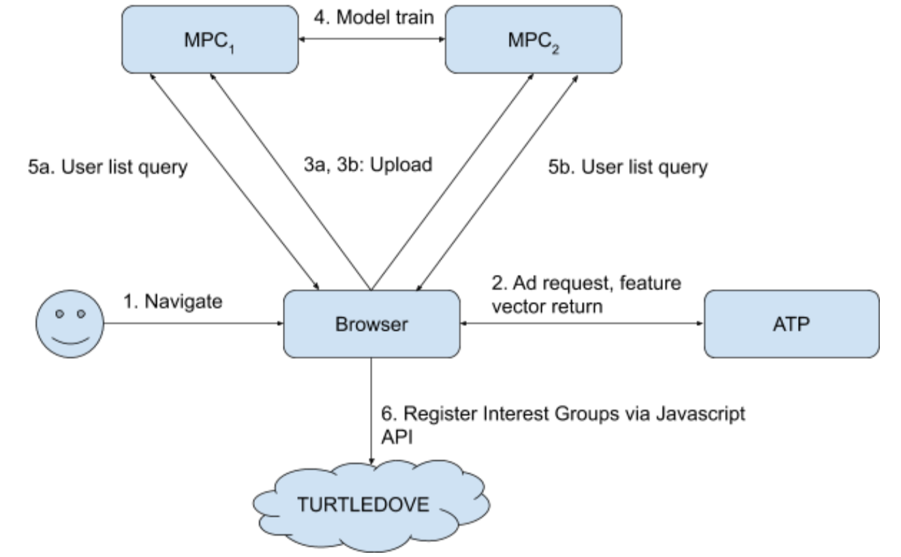

# Prior Art for Multi Party Computation servers

## Overview

This doc describes the operation of the Secure Multi Party Computation (MPC) servers for similar audience ML models.  A high level overview of the system is in a [separate post](https://github.com/google/ads-privacy/tree/master/proposals/scaup).

The aim of this doc is to provide reference the research that currently exists on building ML models on top of MPC servers to give a flavour of what’s currently possible and under investigation.

In the overview we assumed that the mechanism we’d use to keep the user profile data opaque would be secret shares.  There are other crypto choices available, e.g. homomorphic encryption, and so we haven’t limited this doc to schemes that use secret shares.

We have started benchmarking some potential ways of building ML on top of MPC and intend to report back on the results in the future.

### Principles

1. The two MPC servers never see plaintext user profiles and operate only on top of opaque data sent to them from the browser.  We assume that each MPC server is run by a separate party and that they do not collude.
1. Results are also opaque and not visible to the MPC servers.  Only the browser can see the true result.
1. Protection against micro-targeting is enforced with k-anonymity checks inside the MPC Servers.  Applying differential privacy is also possible.

### Setup
The ownership and maintenance of these servers are the same questions as for the [aggregation service helpers](https://github.com/WICG/conversion-measurement-api/blob/master/SERVICE.md#who-runs-the-helper-servers).  We propose using the same solutions as there.

The number of server-to-server round trips between the MPC servers will vary depending on the type of ML models being trained.  The amount of requests from browsers to the servers to add training data should be comparable with the [aggregation service](https://github.com/WICG/conversion-measurement-api/blob/master/SERVICE.md) as requests can be buffered in the browser and do not need to be realtime.  Requests from the browser to evaluate the models can happen periodically, out of band, and do not need to be blocking.

The computation and number of round-trips necessary is important for two reasons:
1. It will determine how much it costs to run the MPC servers.  This cannot be too high or it’ll be prohibitive in terms of compute resources to run them.
1. The sequential calculations and round trips necessary will determine the latency.  Latency is less important for this similar audience use case where requests from the browser can happen asynchronously.

## ML Model processing

### Overview

In the SCAUP overview document we defined the overall flow.  It’s copied here for reference:

*Diagram: overall flow of requests.*
1. *The user navigates the web.*
1. *The browser makes requests to ATPs for ads, to register conversions, etc. ATPs return [feature vectors](https://github.com/google/ads-privacy/tree/master/proposals/scaup#feature-vector-creation) for the browser to store.*
1. *The browser aggregates feature vectors in the selected study period to create a user profile. These are [user profiles and labels](https://github.com/google/ads-privacy/tree/master/proposals/scaup#user-profile-creation) are shared with MPC servers but the shares are protected with cryptographic means so that the servers can’t learn anything about them.*
1. *MPC servers accumulate opaque user profiles and train ML models.*
1. *The browser runs a secure computation protocol with the MPC servers to obtain the similar audiences lists which it should join.*
1. *User lists joined via [TURTLEDOVE API](https://github.com/WICG/turtledove).*

### Limits

So long as the two MPC servers do not collude they cannot learn the secret data that the browser sends to them.

However we cannot give the same guarantee around microtargeting - it will be a matter of policy to have the MPC servers enforce a k-anonymity level to prevent this.  Since training data is uploaded to both MPC servers they both have the ability to enforce k-anonymity and so if one of them fails to follow the protocol then that will be obvious to the other server.

### Current ML + MPC research

The construction of ML models on top of MPC architectures is one of the cutting edges in current research.  We don’t present a full survey of the area here but instead enough of a breadth of examples to demonstrate that what we’re looking to do should be possible.

#### Examples of models

K-nearest-neighbour (kNN) model with differential privacy:
https://content.sciendo.com/view/journals/popets/2020/2/article-p209.xml
 
kNN and naive Bayes classification:
https://eprint.iacr.org/2019/281.pdf

Secure training and prediction using deep neural networks (DNNs):
1. https://arxiv.org/pdf/1907.03372.pdf
1. https://eprint.iacr.org/2020/1002.pdf
1. https://arxiv.org/pdf/1911.07101.pdf

Compiling TensorFlow models to run on top of Secure MPC:
1. https://arxiv.org/abs/1810.10121
1. https://eprint.iacr.org/2020/721.pdf

Federated neural network training:
https://arxiv.org/pdf/2009.00349.pdf

#### Limitations

There are a number of consistent limitations in the current literature:
1. Operations performed on top of integers are easier to implement than those on top of floating point numbers.  This has implications for what ML models and types of training data will be practical.
1. Literature tends to use common public data sets to evaluate the models, for example the [MNIST handwriting data](http://yann.lecun.com/exdb/mnist/).  These data sets are usually significantly smaller in scale than the similar audience data training sets.
1. Efficiency results tend to scale linearly with the complexity of the ML models (e.g. the number of layers in a DNN) as well as to specific data sets.
