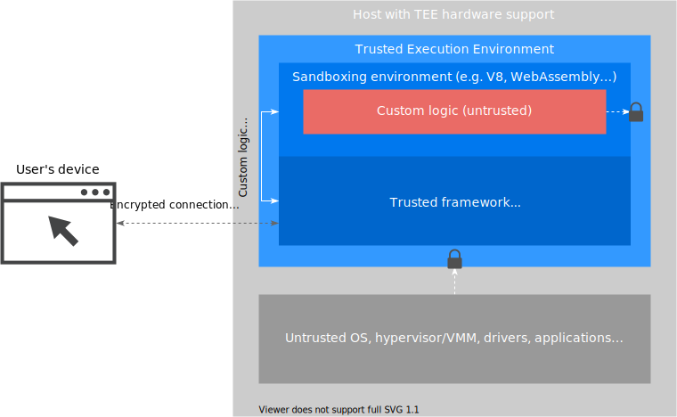

# Trusted Execution Environments and Sandboxes

## Summary

[Sandboxing](https://en.wikipedia.org/wiki/Sandbox_(computer_security)) is a
class of security mechanisms that allow one to impose specific constraints on
what an application code can do, for instance, what APIs it has access to or
what I/O operations it can perform.

[Trusted Execution Environments](https://en.wikipedia.org/wiki/Trusted_execution_environment)
(TEEs) supported by modern hardware technologies such as AMD SEV-SNP
confidential VMs, Intel SGX enclaves offer new confidentiality guarantees for
the [data in use](https://en.wikipedia.org/wiki/Data_in_use). These guarantees
enable processing of sensitive data inside a trusted application while keeping
it secret from all other host system components, including privileged ones (such
as OS kernel). TEEs can be thought of as “reverse sandboxes”, as they disallow
the external parts of the system from “getting in” (accessing information inside
TEE), in contrast with sandboxes which stop the sandboxed application from
“getting out” (sharing information outside of the sandbox).

The combination of sandboxing techniques with TEEs can be a powerful tool: it
may allow running custom, untrusted logic that handles sensitive information –
such as user personal data – server-side, while enforcing strong data
confidentiality guarantees and keeping this information secret from anyone
outside of TEE boundaries.

We propose to use the combination of TEEs and sandboxing mechanisms in
programmatic advertising as the building blocks for enforcing user data
confidentiality requirements, protecting users from cross-site tracking, giving
users transparency and control over their data use while running custom
interest-based ad targeting and bidding algorithms server-side.

## What are Trusted Execution Environments?

A TEE is a hardware-backed isolated environment for executing code that operates
on sensitive data that provides specific security guarantees. These guarantees
may include, depending on the specific TEE architecture:

- **Confidentiality** – data processed within TEE cannot be accessed from
  outside the TEE.

- **Integrity** – data processed within TEE cannot be interfered with from
  outside the TEE.

- **Isolation** – code running within the TEE cannot be interfered with from
  outside the TEE.

- **Verifiability and remote attestation** – an ability for a remote party to
  verifiably establish the code that’s executing (or its author) running within
  the TEE before handing it sensitive data.

Above, “*outside the TEE*” typically refers to other applications or virtual
machines running on the same hardware and privileged components, such as the
operating system, the hypervisor and the operator (root or privileged user).

### Types of modern trusted execution environments

We briefly describe the two main types of trusted execution environments that
are offered by some of the modern hardware. Due to the architectural
differences, they offer somewhat different sets of features and have different
implications on the developer experience and effort involved in adapting
applications to run within TEE.

#### Enclaves

Hardware enclaves allow an application developer to split an application into
two parts, trusted and untrusted, with the trusted part running within the
enclave. The trusted part of the application executing within the enclave will
take advantage of data confidentiality (via memory encryption) and integrity
protections, isolation from all untrusted software running on the host (
including untrusted part of the application, other applications, hypervisor,
host OS).

In some implementations, the trusted application part can also provide
verifiable proofs to remote parties about the identity and authenticity of the
code it runs and its state via remote attestation.

The trusted and the untrusted parts of the application can communicate via the
communication channels that the trusted part explicitly creates and enables, for
example, shared memory.

An example of an enclave
is [Intel SGX](https://software.intel.com/content/www/us/en/develop/topics/software-guard-extensions.html).

#### Encrypted virtual machines

Encrypted virtual machines allow to run a regular, unmodified VM image protected
with a number of security features, which may include, depending on the
implementation:

- Full memory encryption

- Memory isolation from the host and integrity protection

- Remote attestation

#### Enclaves and encrypted VMs compared

| Feature | Encrypted VMs | Enclaves |
|---------|---------------|----------|
| Unit of isolation | Virtual machine | Trusted application part |
| Trusted computing base (TCB) size | Typically, larger: includes guest OS
However, the guest OS can be minimal, e.g. as in the light-weight VMs used by [Kata Containers](https://katacontainers.io/) | Smaller: trusted part of the application |
| Existing code reuse | Can run existing code without changes | Requires architectural and code changes to split the application into trusted and untrusted parts |
| RAM available to the TEE | Potentially, all system RAM | May be limited and thus require costly page swapping between encrypted and regular RAM |
| Confidentiality protections available | RAM encryption and integrity protection[[1]](#ram-integrity-footnote) | RAM encryption and integrity protection |
| Remote attestation | Yes
May need code changes for producing (remote server) and validating (client) attestation
 | Yes |
| Examples
(Specific TEE technologies may have their nuances; we do not aim to compare those in this work)
 | [AMD SEV-SNP](https://www.amd.com/system/files/TechDocs/SEV-SNP-strengthening-vm-isolation-with-integrity-protection-and-more.pdf)   [Intel TDX](https://software.intel.com/content/www/us/en/develop/articles/intel-trust-domain-extensions.html) | [Intel SGX](https://www.intel.com/content/www/us/en/architecture-and-technology/software-guard-extensions.html) |

<a name="bid-value-format">[1]</a> <small>Depending on encrypted VM technology</small>

### TEE threat model

Different TEE hardware implementations have variations in the threats they aim
to protect against. Most of the TEEs that exist today, or are being developed,
treat the entire software stack (outside of the trusted application) running on
the host, and most hardware components outside of the CPU package, as untrusted,
including:

- Host OS.

- BIOS.

- Other applications running on host OS.

- Drivers.

- Host hypervisor.

- Privileged users.

- Memory bus.

- Peripheral devices.

Treating host OS as untrusted means that the secrets maintained by the TEE
cannot be accessed even by the privileged code – such as the code running under
root user or OS kernel code. In the case of encrypted VMs, *guest* OS running
within the TEE necessarily needs to be trusted; however, its code can be
reviewed, audited and attested to ensure it provides the desired security
properties. Further, guest OS size can be minimized (
e.g. [Kata Containers](https://katacontainers.io/)) to minimize the size of the
components (TCB) that need to be reviewed and audited.

The set of trusted components in modern TEEs may be reduced to:

- CPU chip package – and, consequently, CPU manufacturer.

- TEE SDK or framework, if any (such
  as [Teaclave](https://github.com/apache/incubator-teaclave),
  [Enarx](https://enarx.dev/)). It is possible to independently compile and
  verify the SDK version code to avoid needing to trust it.

- Application running within the TEE.

Notably, the hardware owner/operator is not among the trusted parties.

#### Threats not addressed by TEEs

Some of the threats are typically considered out of scope or not foolproof for
TEEs. Those include:

- Hardware scraping.

- Timing attacks – observing how long operations on different inputs take and
  making inferences about those inputs, based on the knowledge about the
  algorithm.

- Availability attacks – the untrusted system could simply deny access to the
  cloud servers hosting this job.

- Malicious TEE hardware vendor
  - Note that there’s inherent trust in the TEE hardware vendor. If that is not
    the case then no other guarantees hold.

- Confidential storage – TEEs do not address either concerns about encryption of
  data at rest in external systems or ensuring that the store doesn’t learn or
  infer what data was accessed. Other techniques can cover that, such as Private
  Information Retrieval or Oblivious RAM. TEEs can provide “sealing” to encrypt
  data with keys that are only stored inside the TEE. 

- Speculative execution attacks – the underlying assumption of hardware assisted
  TEEs is that there are no hardware security bugs. In recent years we have
  witnessed attacks such as [Spectre](https://arxiv.org/pdf/1811.05441.pdf),
  [Foreshadow](https://foreshadowattack.eu/), 
  [L1TF](https://www.intel.com/content/www/us/en/architecture-and-technology/l1tf.html), 
  and [MDS](https://mdsattacks.com/) which exploit hardware implementation flaws
  attempting to extract TEEs data.

  Some of these vulnerabilities can be mitigated by microcode patches, which can
  later be verified as part of the attestation process. Other hardware
  vulnerabilities require patching the software running within the TEE:
  lfences after branches can mitigate Spectre v1, Retpoline can mitigate Spectre
  v2, etc. While TEEs may not be a security panacea, they substantially raise
  the bar for the effort required for unauthorized actors to extract
  confidential data.

## Building blocks

Support for the programmatic advertising use cases with stronger privacy
protections based on TEEs will need to rely on a number of building blocks, each
playing a different role, summarized below.

### Formal data flow constraints

In order to meaningfully protect user privacy, it’s important to explicitly
define what that entails in terms of the user data flows that should be allowed
and disallowed.
A 
[Potential Privacy Model for the Web](https://github.com/michaelkleber/privacy-model), 
with major restrictions on cross-site data access and use, proposes one way to
define allowed ways of accessing user data for web sites, advertisers and
publishers.

[TURTLEDOVE](https://github.com/WICG/turtledove) and the more specific API
definition in [FLEDGE](https://github.com/WICG/turtledove/blob/master/FLEDGE.md)
are also examples of defining specific restrictions on user data flows in the
context of ads personalization. For instance, in TURTLEDOVE, a publisher (or its
technology partners) cannot learn about specific user’s activity on the
advertiser’s website, and vice versa – an advertiser cannot learn about any
single user’s browsing behavior on publisher websites. At the same time,
TURTLEDOVE enables publishers to learn *aggregated* (not specific to any given
user) information about their visitors’ interests on advertiser websites, and
for advertisers to learn which publisher websites their ads were displayed on –
again, only in aggregated form.

A formal language would let us describe these allowed data flows and constraints
more expressively and precisely; such a formal language can be developed based
upon the existing work on the information flow
control ([1](https://pdos.csail.mit.edu/papers/flume-sosp07.pdf),
[2](https://www.cs.cornell.edu/andru/papers/iflow-tosem.pdf)).

### TEE hardware

The hardware may take the form of modern CPUs that support application-level
enclaves or encrypted virtual machines. The scope of the provided guarantees and
threat vectors that hardware-based TEEs aim to protect against were described
above.

### TEE hardware abstraction layer

Hardware-assisted TEEs – either application-level enclaves or encrypted virtual
machines – require to use new instructions and API surfaces provided by the CPU
vendor in order to create, load application code and startup a TEE or perform
the remote attestation sequence. These API surfaces can be fairly low-level, and
a hardware abstraction layer is needed to isolate the application code from this
low-level complexity.

An enclave SDK (such as [Enarx](https://enarx.dev/)
or [Graphene](https://grapheneproject.io/)) enables developers to focus on
writing applications that can run within enclave, taking advantage of the
confidentiality, integrity and remote attestation features, while abstracting
away the complexity and vendor specifics of the underlying low-level hardware
interface.

While an SDK is typically necessary for writing applications running inside
[enclaves](#enclaves), it is possible to run unmodified code built using the
conventional toolchains within [encrypted VMs](#encrypted-virtual-machines) (
remote attestation support may still need extra code). At the same time,
encrypted VMs require support from the host hypervisor that orchestrates
the startup and execution of VMs.

### Sandboxing environment

A sandboxing environment or framework enforces the desired information flow
constraints and data confidentiality by only exposing a narrow, pre-defined set
of allowed APIs to the ads application code (e.g. bidding, auction or reporting
logic). The sandboxed application, for instance, may have no access to network,
storage, logging or perform any other side effect operations without an explicit
permission from the sandbox embedder. In the case of sandboxing for ads
personalization, these operations can be allowed only as long as the data
leaving the sandbox is sufficiently anonymized.

A few well-known contemporary approaches to sandboxing are described below.

#### Language and bytecode runtimes

Popular examples of the sandboxing environments include JavaScript runtimes (
such as [V8](https://v8.dev/)) and WebAssembly runtimes (such
as [Wasmer](https://wasmer.io/)). In addition to sandboxed application code
execution, these runtimes are platform-independent: application written (and,
optionally, compiled, in the case of WebAssembly) once can run on different
hardware platforms. By default, both JavaScript and WebAssembly runtimes do not
provide access to I/O or any other side effects to application code; these
functionalities can only be explicitly provided by the sandbox embedder if
deemed necessary. “*No access to side effects by default*” is a valuable
property in enforcing the privacy-motivated data flow constraints.

#### Sandboxing container runtimes

Other examples of sandboxing environments include container runtimes based on
application-level kernel, such as [gVisor](https://gvisor.dev/), and based on
light-weight VMs, such as [Kata containers](https://katacontainers.io/) and
[Firecracker](https://firecracker-microvm.github.io/). These environments allow
to run native Linux-targeted code packaged into containers while imposing
sandboxing restrictions by intercepting and implementing syscalls while
restricting access to I/O based on the desired sandboxing policy.

#### Linux seccomp-bpf sandboxes

[seccomp-bpf](https://en.wikipedia.org/wiki/Seccomp) is a security facility in
Linux kernel that allows to transition and run a process in a secure state,
allowing to intercept and filter system calls. Intercepting system calls allows
one to enforce fine-grained policies on access to I/O (disk, network, local
sockets), memory allocation and CPU time
limits. [Sandbox2](https://developers.google.com/sandboxed-api/docs/sandbox2/how-it-works)
is one example of a seccomp-bpf-based sandbox.

### Remote attestation

[Remote attestation](https://en.wikipedia.org/wiki/Trusted_Computing#Remote_attestation)
is a process that allows convincing one party (such as a client) about the
identity (such as binary hash)
of the software running on a remote machine (a server), and usually also part of
the hardware state. Remote attestation process frequently relies on:

- Cryptographic techniques, for instance, the use of asymmetric key signature
  over a remote attestation quote.

- Hardware-backed implementation, where a CPU, possibly assisted by TEE
  firmware, constructs and signs the remote attestation quote with a
  hardware-bound private key.

Remote attestation in combination with an auditable and open-source codebase,
allows clients to establish the confidence that the expected user
privacy-motivated constraints and restrictions on the data flows will be
enforced. These techniques can be the key components for establishing trust to a
remote server in ads personalization.

### Custom sandboxed logic

Finally, custom application logic defined and implemented by ad tech companies,
publishers and advertisers, and running within the
standardized [sandboxing environment](#sandboxing-environment), can be used for
ad targeting, bidding, reporting, fraud and abuse detection and other use cases.

*Importantly, the custom application logic itself need not be trusted, reviewed
or audited, if it can only be run within the
trusted [sandboxing environment](#sandboxing-environment)*, which in turn would
enforce the intended privacy-driven constraints on the data flows.

By default, the custom logic running inside a sandboxed environment must not
have access to the network, I/O or have the ability to produce any side effects.
Only the data flows explicitly allowed by the sandboxing environment may be
permitted – for instance, submitting events for aggregated reporting.

## Potential applications of TEEs in programmatic advertising

Thanks to the properties offered by TEEs and sandboxes (confidentiality and
integrity guarantees, binary identity and remote attestation), systems built on
top of those can provide verifiably strong data flow and confidentiality
protections for different programmatic advertising use cases. A few possible
examples are touched on below.

### Server-side TURTLEDOVE bidding and auction logic execution

A software framework that relies on sandboxing for the execution of the custom
bidding and auction logic and that runs server-side inside a TEE may have the
potential to provide strong, verifiable guarantees that may fit
the [desired privacy model of TURTLEDOVE](https://github.com/WICG/turtledove/blob/master/Original-TURTLEDOVE.md#introduction):

- Advertisers (and their technology partners) can serve ads based on an
  interest, but cannot combine that interest with other information about the
  person — in particular, with who they are or what page they are visiting.

- Web sites a person visits, and the ad technology partners those sites use,
  cannot learn about their visitors' ad interests.

Running TURTLEDOVE logic in a trusted server-side environment would enable
significant savings of client-side resources, resulting in better user browser
experience.

### User consent and control

TEEs can facilitate verifiable enforcement of users’ choices about their data
use and sharing happening remotely on a server. This may potentially include
tools to support privacy regulation compliance. For example, a standardized
software framework running within TEEs and used by ad tech companies could
enforce user’s consent for server-side sharing of website browsing information
with a chosen set of ad technology partners and, optionally, the specific
purposes of allowed data use by those partners.

### Private aggregation and analytics

Part of the Chrome Privacy Sandbox proposals is
an [aggregate reporting system](https://github.com/csharrison/aggregate-reporting-api)
that ensures user privacy by providing only aggregated data.

One way that it may be possible to extend this to allow custom aggregation is
through using TEEs, with sandboxes, to generate custom reports that would still
be subject to the same privacy requirements (via either differential privacy or
K-anonymity).

### Fraud and abuse detection with strong privacy protections

Modern ad fraud and abuse detection systems may rely on high-entropy or
identifying information about user’s devices (such as an IP address or other
granular device characteristics) to identify traffic anomalies and distinguish
organic traffic from fraudulent activity. While being vital for fraud and abuse
detection, such high-entropy signals may present user re-identifiability and
cross-site tracking risks. Ad fraud detection mechanisms that rely on such
high-entropy signals can be run within a TEE, thus guaranteeing that such
signals can only be used for the expected purposes, and cannot be used for
tracking or targeting ads to individual users.

## Appendix: references

### Open-source TEE frameworks

There are a few open-source frameworks and SDKs in active development that make
it easier to develop software protected by TEE guarantees:

- [Enarx](https://enarx.dev/): allows to run applications compiled to
  WebAssembly bytecode on Intel SGX and AMD SEV

- [Project Oak](https://github.com/project-oak/oak): a specification and a
  reference implementation for the secure transfer, storage and processing of
  data on top of TEE and sandboxing.

- [Teaclave](https://github.com/apache/incubator-teaclave): A Universal Secure
  Computing Platform that allows to run user-provided functions securely within
  a TEE.

### TEE whitepapers, specifications and architectural overviews

1. [AMD SEV-SNP: Strengthening VM Isolation with Integrity Protection and More](https://www.amd.com/system/files/TechDocs/SEV-SNP-strengthening-vm-isolation-with-integrity-protection-and-more.pdf)

2. [SEV Secure Nested Paging Firmware ABI Specification](https://www.amd.com/system/files/TechDocs/56860.pdf)

3. [Intel SGX explained](https://eprint.iacr.org/2016/086.pdf)

4. [Intel® Trust Domain Extensions](https://software.intel.com/content/dam/develop/external/us/en/documents/tdx-whitepaper-final9-17.pdf)

5. [Confidential Computing Deep Dive whitepaper](https://confidentialcomputing.io/wp-content/uploads/sites/85/2020/10/Confidential-Computing-Deep-Dive-white-paper.pdf)

### Oblivious RAM assisted by TEE hardware support

1. [ZeroTrace: Oblivious Memory Primitives from Intel SGX](https://eprint.iacr.org/2017/549.pdf)

2. [Hardware-Supported ORAM in Effect: Practical Oblivious Search and Update on Very Large Dataset](https://content.sciendo.com/downloadpdf/journals/popets/2019/1/article-p172.pdf)

### Potential practical applications of TEEs

1. [X-Search: Revisiting Private Web Search using Intel SGX](https://arxiv.org/pdf/1805.01742.pdf)

2. [Secure Content-Based Routing Using Intel Software Guard Extensions](https://dl.acm.org/doi/pdf/10.1145/2988336.2988346)

3. [pRide: Private Ride Request for Online Ride Hailing Service with Secure Hardware Enclave](https://dl.acm.org/doi/pdf/10.1145/3326285.3329062)

### Securing applications running within TEEs

1. [Securing Intel SGX Against Side-channel Attacks via Load-time Synthesis](https://smartech.gatech.edu/bitstream/handle/1853/62337/SHIH-DISSERTATION-2019.pdf)
